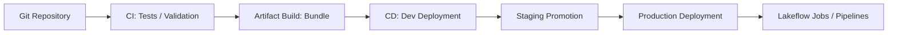

# 音声スクリプト: Implementing CI/CDの全体像

## はじめに

CI/CDはアプリケーション開発のための仕組みと思われがちですが、データ基盤ではその役割がさらに重要になります。なぜなら、ノートブックやSQLの変更は、そのまま本番データの品質、分析結果、AIに渡る特徴量、業務判断に影響するからです。

DatabricksにおけるCI/CDは、単にコードをデプロイする仕組みではありません。ノートブック、SQL、Lakeflow Jobs、パイプライン、テーブル定義といった「データパイプラインそのもの」を、安全に進化させるための仕組みです。データ基盤では、データ処理定義がプロダクトであり、それを継続的に変化させるためにリリース管理が必要になります。

## 本チャプターのゴール

ゴールは、Implementing CI/CDを「変更を本番へ反映する作業」ではなく、「データ処理定義を安全に検証し、環境ごとに段階的に反映する設計」として説明できるようになることです。

特に、Databricks Git Folders、branch切替、commit、push、pull request、Databricks Asset Bundles、environment-specific configuration、dev / staging / prod promotion、Databricks CLI、automated CI/CD workflowsを、データ品質と運用安全性の観点で理解します。

## 背景

### データ基盤では「変更＝データの変化」である

アプリケーションでは、小さなコード変更が画面表示やロジックの変更にとどまる場合があります。しかしデータ基盤では、小さな変換ロジックの変更が、テーブルの値、集計結果、ダッシュボード、下流のAI処理に直接影響します。

さらに、データ処理は状態を持ちます。Deltaテーブル、履歴、チェックポイント、ジョブ実行履歴、スキーマ、権限があり、変更後の処理は過去データや継続処理と関係します。そのため、手元でNotebookが動いたことだけでは、本番データを安全に変えてよいとは言えません。

### 環境差分（dev / stg / prod）がデータ品質に直結する

dev、staging、prodでは、データ量、スキーマ、権限、外部接続、Unity Catalogのカタログ名、ジョブのスケジュールが異なることがあります。devで少量データに対して成功した処理が、prodの大量データや厳しい権限では失敗することもあります。

手動デプロイは、どの定義をどの環境へ反映したのかを曖昧にし、再現性を壊します。ジョブ、パイプライン、テーブル定義、権限に関わる設定を一貫して管理できないと、環境不整合やデータ破壊につながります。そのためDatabricksのCI/CDでは、コードだけでなくデータ処理定義をバージョン管理し、環境ごとに安全に反映することが重要です。

## 重要な考え方

### データパイプラインもソフトウェアと同じくバージョン管理する

Databricksで管理すべき対象は、Pythonファイルだけではありません。Notebook、SQLクエリ、Lakeflow Jobs、パイプライン、テーブル定義、設定値、環境ごとの差分も含めて、データプロダクトを構成する定義です。

Gitでbranch、commit、push、pull requestを使うことで、誰が何を変更したのか、どのレビューを通過したのか、どの変更が本番に入ったのかを追跡できます。これは単なる開発作法ではなく、データ品質と監査可能性を守るための土台です。

### 環境分離はコードではなくデータの安全性のためにある

環境分離は、devで自由に試し、stagingで本番に近い条件を検証し、prodで安定運用するためにあります。データ基盤では、環境を分ける目的はコードの整理だけではなく、本番データを不用意に壊さないことです。

environment-specific configurationでは、catalog、schema、warehouse、cluster、ジョブスケジュール、権限、外部接続先などを環境ごとに切り替えます。同じ処理定義でも、どのデータに対して、どの権限で、どの規模で動くかが変わるため、環境差分の管理がデータ品質に直結します。

### デプロイは「実行」ではなく「定義の反映」である

CI/CDで本番へ反映するのは、手元のNotebookをその場で実行することではありません。Lakeflow Jobsの定義、タスク依存、NotebookやSQLの参照先、パイプライン設定、テーブル定義などを、環境に対して再現可能な形で反映することです。

そのため、Databricks Asset BundlesやCLIを使うときも、重要なのはコマンドの暗記ではありません。どの定義を、どの環境へ、どの順番で、どの検証を通して反映するかを設計することです。

### CIはテスト、CDは安全なプロモーションである

| 観点     | 従来のアプリCI/CD | データ基盤CI/CD             |
| -------- | ----------------- | --------------------------- |
| 対象     | アプリコード      | ノートブック / SQL / ジョブ |
| 変更影響 | UI/ロジック       | データ品質 / 分析結果       |
| テスト   | 単体・結合        | データ品質・スキーマ・依存  |
| デプロイ | アプリ更新        | パイプライン定義更新        |
| 失敗影響 | 機能停止          | データ破壊・誤分析          |

CIでは、構文やテストだけでなく、スキーマ、データ品質、依存関係、設定の妥当性を検証します。CDでは、devからstaging、prodへ段階的にプロモーションし、同じ定義を再現可能に反映します。CI/CDは速く本番へ出すためだけではなく、データを壊さずに変化させるための安全装置です。

## 具体的なイメージ

### Gitから本番Jobsへ定義を届ける流れ



この流れでは、GitでNotebook、SQL、Jobs、パイプライン定義を管理し、CIでテストや検証を行います。その後、Bundleとして環境へ反映できる形にまとめ、CDでdev、staging、prodへ段階的にデプロイします。

### Databricks Asset Bundlesの定義イメージ

```yaml
resources:
  jobs:
    etl_pipeline:
      name: etl-pipeline
      tasks:
        - task_key: transform
          notebook_task:
            notebook_path: src/transform.py
```

このYAMLは概念理解用です。重要なのは、ジョブ名、タスク、Notebook参照などを手動クリックではなく定義として管理している点です。定義がGitでレビューされ、CIで検証され、CDで環境へ反映されることで、Lakeflow Jobsやパイプラインが安全に更新されます。

CI/CDは、JobsやLakeflowの実行そのものを置き換えるものではありません。Jobsやパイプラインが実行する定義を、環境ごとに安全に配布する仕組みです。

## 次の学習へのつながり

CI/CDでデータ処理定義をprodへ反映したら、それで終わりではありません。デプロイ後には、Lakeflow Jobsの実行履歴、DAG、Spark UI、ログ、データ品質チェックを見て、想定どおり動いているかを監視する必要があります。

次のTroubleshooting, Monitoring, and Optimizationでは、失敗したジョブ、遅い処理、データスキュー、ライブラリ競合、クラスタ起動失敗などを確認し、継続的に改善する観点を学びます。

さらに、Governance and Securityでは、誰が変更できるのか、誰が本番データを読めるのか、どの変更を監査できるのかを扱います。CI/CDは終点ではなく、監視、最適化、ガバナンスへつながる運用の入口として理解しましょう。
