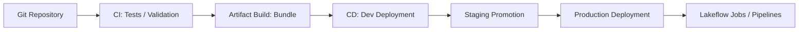

# 音声スクリプト: Implementing CI/CDの全体像

## はじめに

[CI](#keyword-ci) / [CD](#keyword-cd)はアプリケーション開発のための仕組みと思われがちですが、データ基盤ではその役割がさらに重要になります。なぜなら、ノートブックやSQLの変更は、そのまま本番データの品質、分析結果、AIに渡る特徴量、業務判断に影響するからです。

DatabricksにおけるCI/CDは、単にコードをデプロイする仕組みではありません。ノートブック、SQL、Lakeflow Jobs、パイプライン、テーブル定義といった「データパイプラインそのもの」を、安全に進化させるための仕組みです。**DatabricksにおけるCI/CDは、データパイプラインの変更を安全かつ再現可能に反映するための仕組み**です。

## 本チャプターのゴール

このチャプターでは、DatabricksにおけるCI/CDの目的と、環境間で安全に変更を反映するための判断軸を説明できるようになることを目指します。

特に、[Git](#keyword-git)、[branch](#keyword-branch)、[pull request](#keyword-pull-request)、[dev](#keyword-dev)、[stg](#keyword-stg)、[prod](#keyword-prod)、[environment](#keyword-environment)、[Declarative Automation Bundles](#keyword-declarative-automation-bundles)、[bundle validate](#keyword-bundle-validate)、[deployment](#keyword-deployment)、[promotion](#keyword-promotion)を、データ品質と運用安全性の観点で理解します。

## 背景

### データ基盤では「変更＝データの変化」である

アプリケーションでは、小さなコード変更が画面表示やロジックの変更にとどまる場合があります。しかしデータ基盤では、小さな変換ロジックの変更が、テーブルの値、集計結果、ダッシュボード、下流のAI処理に直接影響します。**データ基盤における変更は、最終的にデータの変化として利用者へ届く**と考えます。

さらに、データ処理は状態を持ちます。Deltaテーブル、履歴、チェックポイント、ジョブ実行履歴、スキーマ、権限があり、変更後の処理は過去データや継続処理と関係します。そのため、手元でNotebookが動いたことだけでは、本番データを安全に変えてよいとは言えません。

### 環境差分（dev / stg / prod）がデータ品質に直結する

devは、開発者が変更を試す環境です。stgは、本番に近い条件で動作確認する環境です。prodは、業務・分析利用者に実際のデータを提供する環境です。環境を分ける目的は、単に名前を変えることではなく、**本番データを守りながら変更を検証すること**です。

同じコードでも、対象データ、権限、カタログ、ジョブ設定、外部接続先は環境ごとに異なります。devで少量データに対して成功した処理が、prodの大量データや厳しい権限では失敗することもあります。

環境差分は、設定ファイルや変数で管理し、コード本体を環境ごとに分岐させないことが重要です。手動デプロイは、どの定義をどの環境へ反映したのかを曖昧にし、再現性を壊します。ジョブ、パイプライン、テーブル定義、権限に関わる設定を一貫して管理できないと、環境不整合やデータ破壊につながります。

## 重要な考え方

### データパイプラインもソフトウェアと同じくバージョン管理する

Databricksで管理すべき対象は、Pythonファイルだけではありません。Notebook、SQLクエリ、Lakeflow Jobs、パイプライン、テーブル定義、設定値、環境ごとの差分も含めて、データプロダクトを構成する定義です。

Gitでbranch、commit、push、pull requestを使うことで、誰が何を変更したのか、どのレビューを通過したのか、どの変更が本番に入ったのかを追跡できます。これは単なる開発作法ではなく、**データ品質と監査可能性を守るための土台**です。

### 環境分離はコードではなくデータの安全性のためにある

環境分離は、devで自由に試し、stgで本番に近い条件を検証し、prodで安定運用するためにあります。データ基盤では、環境を分ける目的はコードの整理だけではなく、本番データを不用意に壊さないことです。

environment-specific configurationでは、catalog、schema、warehouse、cluster、ジョブスケジュール、権限、外部接続先などを環境ごとに切り替えます。同じ処理定義でも、どのデータに対して、どの権限で、どの規模で動くかが変わります。**環境差分をコードから切り離して管理すること**が、再現性と安全性につながります。

### デプロイは「実行」ではなく「定義の反映」である

CI/CDで本番へ反映するのは、手元のNotebookをその場で実行することではありません。Lakeflow Jobsの定義、タスク依存、NotebookやSQLの参照先、パイプライン設定、テーブル定義などを、環境に対して再現可能な形で反映することです。

そのため、Declarative Automation BundlesやCLIを使うときも、重要なのはコマンドの暗記ではありません。**どの定義を、どの環境へ、どの検証を通して反映するか**を設計することです。

### CIはテスト、CDは安全なプロモーションである

CIとCDはどちらも自動化に関係しますが、役割は同じではありません。CIは変更を本番へ進めてよいかを検証する段階であり、CDは検証済みの定義を環境へ段階的に反映する段階です。

| 観点     | 従来のアプリCI/CD | データ基盤CI/CD             |
| -------- | ----------------- | --------------------------- |
| 対象     | アプリコード      | ノートブック / SQL / ジョブ |
| 変更影響 | UI/ロジック       | データ品質 / 分析結果       |
| テスト   | 単体・結合        | データ品質・スキーマ・依存  |
| デプロイ | アプリ更新        | パイプライン定義更新        |
| 失敗影響 | 機能停止          | データ破壊・誤分析          |

CIでは、構文やテストだけでなく、スキーマ、データ品質、依存関係、設定の妥当性を検証します。CDでは、devからstg、prodへ段階的にpromotionし、同じ定義を再現可能に反映します。CI/CDは速く本番へ出すためだけではなく、**データを壊さずに変化させるための安全装置**です。

## 具体的なイメージ

### Gitから本番Jobsへ定義を届ける流れ

Gitで管理された定義は、そのまま本番へ置くのではなく、検証、成果物化、環境ごとのdeploymentを通して段階的に反映します。この流れにすることで、レビュー済みの変更だけをdev、stg、prodへ進め、どの定義がどの環境に入ったかを追跡できます。



この流れでは、GitでNotebook、SQL、Jobs、パイプライン定義を管理し、CIでテストや検証を行います。その後、Bundleとして環境へ反映できる形にまとめ、CDでdev、stg、prodへ段階的にデプロイします。

### Declarative Automation Bundlesの定義イメージ

Declarative Automation Bundlesは、ジョブやパイプラインなどのDatabricks資源を、コードとして管理・配布するための定義です。2026年3月に旧称Databricks Asset Bundlesから名称変更され、資産の束ではなく、Databricks上の定義を宣言的に自動化する仕組みであることがより明確になりました。Bundlesを使うと、ジョブ名、タスク、Notebook参照、環境ごとの設定を、手動クリックではなくレビュー可能なファイルとして扱えます。

```yaml
resources:
  jobs:
    etl_pipeline:
      name: etl-pipeline
      tasks:
        - task_key: transform
          notebook_task:
            notebook_path: src/transform.py
```

このYAMLは概念理解用です。重要なのは、ジョブ名、タスク、Notebook参照などを手動クリックではなく定義として管理している点です。定義がGitでレビューされ、CIでbundle validateなどの検証を受け、CDで環境へ反映されることで、Lakeflow Jobsやパイプラインが安全に更新されます。

CI/CDは、JobsやLakeflowの実行そのものを置き換えるものではありません。Jobsやパイプラインが実行する定義を、環境ごとに安全に配布する仕組みです。

## 次の学習へのつなぎ

CI/CDで変更を安全に反映できても、本番環境で処理が遅くなったり失敗したりする可能性は残ります。**デプロイ後の実行を観測し、問題を切り分け、改善し続けること**が次のテーマです。

次のチャプターでは、ジョブ履歴、DAG、Spark UIなどを使い、障害や性能劣化を観測・切り分け・改善するTroubleshooting, Monitoring, and Optimizationを学びます。
