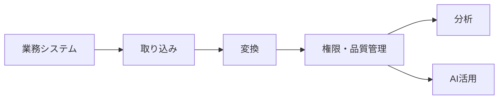

# Databricks Intelligence Platformの全体像

## はじめに

今回は、Databricks Intelligence Platformの全体像を、データエンジニアの日常に近い流れで見ていきます。機能名を順番に覚える前に、「なぜ統合された基盤が必要になったのか」を押さえると、後から出てくるサービスや用語がつながりやすくなります。

## 本チャプターのゴール

Databricks Intelligence Platformがデータの取り込み、変換、分析、AI活用を同じ流れで扱うための**統合的な基盤**だと説明できることがゴールです。併せて、個別ツールの寄せ集めではなく、**統合基盤**でデータを扱う意味をイメージ出来ることを目指します。

## 背景

### 従来のデータ基盤の課題

従来のデータ基盤では、データを集める場所、変換する仕組み、分析する環境、機械学習やAIで使う環境が別々になりがちでした。たとえば、データレイクにファイルを置き、別のETLツールで加工し、データウェアハウスにコピーし、さらにAI用の環境へ渡す、というように、データが何度も移動します。

### 問題はツールの多さではなく、データの移動量と分断

この構成では、**同じはずのデータが場所によって少しずつ違って見えること**があります。権限管理も環境毎に分かれ、ジョブの失敗や変更の影響を追いかけるのも大変です。アナリストは「どのテーブルが正しいのか」を確認し、データエンジニアは「どこまで処理が終わったのか」を調べ、AI担当者は「使って良いデータなのか」を確かめる必要があります。

つまり、単にツールが多いことが問題ではありません。**データの移動量と分断**が増えることで、チーム全体が**同じデータを安心して使うのが難しくなることが問題**なのです。

## 中心となる考え方

### 統合基盤で扱うという発想

Databricks Intelligence Platformは、このデータの分断を減らし、データとAIの作業を**統合基盤**の上で繋げて扱う考え方です。土台になるのは[Lakehouse](#lakehouse)の考え方です。「データレイク」のように多様なデータを柔軟に置ける一方で、「データウェアハウス」のように管理されたテーブルとして扱える状態を目指します。

### 機能は課題解決の役割で見る

[Delta Lake](#delta-lake)は信頼できるテーブル管理を支え、[Unity Catalog](#unity-catalog)はデータやAI資産の権限とガバナンスを一元的に扱いやすくします。[Workflows](#workflows)は処理の実行順序やスケジュールを管理し、Databricks SQLは同じ基盤上のデータをSQLで分析する入口になります。

ここで大切なのは、機能名を単独で覚えることではありません。データを取り込み、変換し、品質を保ち、権限を管理し、分析やAIに渡すまでを、なるべく同じ文脈で扱うことに意味があります。そうすると、データのコピーや確認作業が減り、チームが「どのデータを信頼するか」を揃えやすくなります。

## 具体的なイメージ

### 取り込みからAI活用までを1つの流れで見る

たとえば、業務システムの売上データを毎日取り込み、不要な列を整え、集計用のテーブルを作り、ダッシュボードやAIモデルの特徴量として使う場面を考えます。環境が分断されていると、取り込み、加工、分析、AI活用のたびにデータの置き場所や権限、実行ログを別々に確認しなければなりません。

### 共通の管理下で使う

統合的なプラットフォームとして見ると、この一連の作業は1つの流れになります。データエンジニアはパイプラインを管理し、アナリストは整備されたテーブルを参照し、AI担当者は同じ信頼できるデータを使います。全員が同じ基盤を見ているため、問題が起きた時にも、どの処理で、どのデータに、どの権限でアクセスしたのかを追いやすくなります。

補助的に整理すると、分断された基盤では「移動してから使う」場面が増えます。統合した基盤では「**共通の管理下で使う**」ことを目指します。この違いが、Databricks Intelligence Platformを理解する入口です。

## 次の学習へのつなぎ

次のチャプターでは、この統合基盤の土台にあるLakehouseと、それを信頼できるテーブル管理として支えるDelta Lakeの関係を見ていきます。ここではまず、Databricksを単体ツールの集合ではなく、データエンジニアリングから分析、AI活用までを繋ぐ統合基盤なのだと捉えておきましょう。
