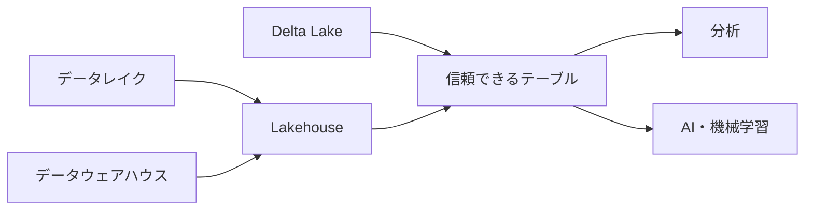

# 音声スクリプト: LakehouseとDelta Lakeの位置づけ

## はじめに

今回は、LakehouseとDelta Lakeの位置づけを整理します。どちらもDatabricksの学習でよく出てくる言葉ですが、同じ意味ではありません。**Lakehouse**は全体の考え方、**Delta Lake**はその考え方の中でテーブルを信頼できる形に近づける技術、と考えると理解しやすくなります。

## 本チャプターのゴール

聞き終わったあとに、データレイク、データウェアハウス、Lakehouse、Delta Lakeの関係を自分の言葉で説明できることを目指します。特に、Lakehouseが必要になった背景と、Delta Lakeが埋める問題を分けて説明できるようにします。

## 背景

### データレイクだけでは困ること

データレイクは、大量で多様なデータを保存しやすい場所です。ログ、CSV、JSON、画像、ストリーミングデータなど、まだ使い道が決まりきっていないデータも柔軟に置けます。一方で、ファイルを置くだけの状態が続くと、どれが最新か、どのスキーマが正しいか、更新や削除をどう安全に扱うかが分かりにくくなります。いわゆるデータの沼のような状態になり、分析に使うには不安が残ります。

### データウェアハウスだけでは困ること

データウェアハウスは、整理されたデータを高速に分析するのに向いています。定義済みのテーブル、権限管理、SQLでの集計などは得意です。ただし、すべての生データや多様な形式のデータを柔軟に扱うには制約が出ることがあります。機械学習やAIで使いたい細かなログや半構造化データを、まず別の場所に置いてから加工する、といった分断も起きやすくなります。

このように、データレイクだけでは管理性が足りず、データウェアハウスだけでは柔軟性が足りない場面があります。その間を埋めようとする考え方が[Lakehouse](#keyword-lakehouse)です。

## 重要な考え方

### Lakehouseは全体像

Lakehouseは、**データレイクの柔軟性**と**データウェアハウスの管理性**を近づけるアーキテクチャの考え方です。オープンなストレージに多様なデータを置きながら、分析やパイプラインで安心して使えるテーブルとして扱える状態を目指します。

### Delta Lakeは信頼できるテーブル管理

ここで重要になるのが[Delta Lake](#keyword-delta-lake)です。Delta Lakeは、Lakehouse上のデータを**信頼できるテーブル**として管理するための技術です。たとえば、複数の処理が同じテーブルに関わるときでも一貫性を保つ[ACIDトランザクション](#keyword-acid-transaction)、想定外の列や型の変化を扱う[スキーマ管理](#keyword-schema-management)、過去の状態を追いやすくする[履歴管理](#keyword-history-management)などを提供します。

つまり、Lakehouseは「どんな基盤を目指すのか」という全体像です。Delta Lakeは「その基盤でデータを壊さず、信頼して使うために何を支えるのか」という具体的なテーブル管理の仕組みです。この役割分担を分けて考えると、用語を丸暗記しなくても、なぜ必要なのかが見えてきます。

## 具体的なイメージ

### 分析とAIで同じデータを使う場面

たとえば、ECサイトのクリックログと注文データを使って、売上分析とレコメンドモデルの両方を作りたいとします。データレイクにログを置くだけなら保存は簡単ですが、途中でスキーマが変わったり、重複データを削除したり、過去の状態に戻したりする場面で不安が残ります。

一方、データウェアハウスにきれいに整えたデータだけを入れると、BI分析には便利です。しかし、機械学習で使いたい細かなログや新しい種類のデータをすぐに試すには、別の場所や別の処理が必要になるかもしれません。

次の図は、データレイクとデータウェアハウスの課題をLakehouseが受け止め、その上でDelta Lakeが信頼できるテーブルを支える関係を示します。左から右へ、保存基盤の考え方、テーブル管理、分析・AI活用の順に読みます。

### 役割比較で整理する

Lakehouseの考え方では、多様なデータを柔軟に保ちながら、重要なデータは管理されたテーブルとして扱います。Delta Lakeがそのテーブルに信頼性を足すことで、データエンジニアはパイプラインを安全に更新し、分析担当者は同じテーブルをSQLで参照し、AI担当者は履歴や品質を意識しながらデータを使えるようになります。

次の表は、どれが優れているかを決める表ではありません。柔軟性、管理性、テーブル信頼性の役割差を整理し、実務でどの課題を補う必要があるかを見るための表です。

| 観点               | データレイク                           | データウェアハウス           | Lakehouse                  |
| ------------------ | -------------------------------------- | ---------------------------- | -------------------------- |
| 得意なこと         | 多様なデータの保存                     | 整理済みデータの分析         | 柔軟性と管理性の両立       |
| 困りやすいこと     | 品質・履歴・更新管理                   | 生データや多様な形式の扱い   | テーブル信頼性の設計       |
| Delta Lakeの関わり | ファイルを信頼できるテーブルに近づける | 管理された分析体験に近づける | 中核のテーブル管理を支える |

## 次の学習へのつなぎ

ここまでで、LakehouseとDelta Lakeにより、分析やAI活用の前提になる信頼できるデータの土台を押さえました。次のChapter 3では、その土台の上でSQL、ジョブ、ノートブック、サーバレスなどのワークロードに応じて、どのcomputeを選ぶかへ進みます。まずは、Lakehouseは全体の考え方、Delta Lakeは信頼できるテーブル管理を支える技術、という一文で説明できるようにしておきましょう。
