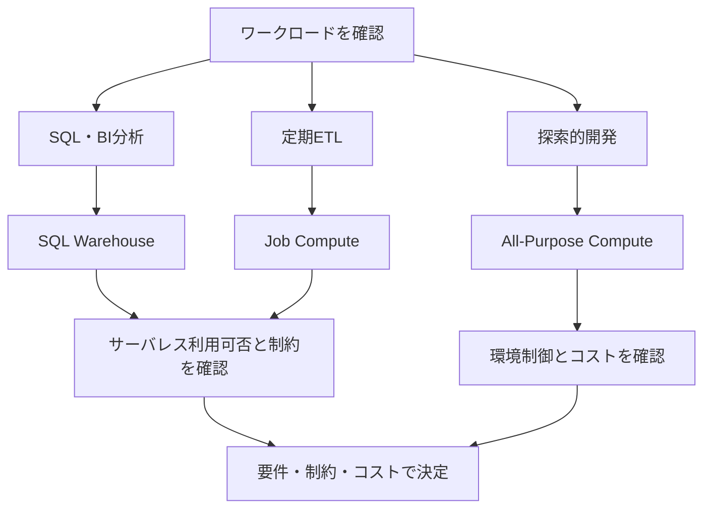

# 音声スクリプト: Compute servicesとワークロード選定

## はじめに

今回は、Databricks Intelligence Platformで処理や分析を実行するcomputeを、ワークロードに応じて選ぶ考え方を扱います。サイズの大きい小さいだけで決めるのではなく、SQL分析、定期ETL、探索的開発、定期実行など、何を実行したいのかから判断します。

## 本チャプターのゴール

聞き終わったあとに、[Serverless Compute](#keyword-serverless-compute)、[SQL Warehouse](#keyword-sql-warehouse)、[Job Compute](#keyword-job-compute)、[All-Purpose Compute](#keyword-all-purpose-compute)を、暗記ではなく用途から選べることを目指します。特に、運用責任、制御範囲、[起動時間](#keyword-startup-time)、同時利用、[実行分離](#keyword-execution-isolation)、[コストモデル](#keyword-cost-model)のトレードオフを説明できるようにします。

## 背景

### computeは処理の置き場所ではなく、運用判断の対象

LakehouseとDelta Lakeで信頼できるデータの土台を理解したら、次はそのデータをどの実行基盤で処理するかを考えます。同じテーブルを読む場合でも、利用者がBIで同時にSQLを投げるのか、毎朝のETLとして自動実行するのか、ノートブックで試行錯誤するのかで、適したcomputeは変わります。

ここで大切なのは、computeを「高性能なものを選ぶ問題」とだけ見ないことです。**computeはワークロードの性質から選びます。** 性能だけでなく、誰が使うのか、いつ動くのか、失敗時にどこまで[ワークロード分離](#keyword-workload-isolation)したいのか、どれだけ環境を制御したいのかを合わせて見ます。

## 重要な考え方

### サーバレスをまず候補に置く

利用できるリージョン、機能、組織の制約を満たすなら、サーバレスは最初に確認する候補です。サーバレスでは、インフラ管理の多くをDatabricks側に任せられ、起動やスケールの運用負担を小さくできます。

ただし、サーバレスが常に正解という意味ではありません。明示的なネットワーク構成、特定ライブラリ、実行環境の細かな制御、組織固有の制約が必要な場合は、非サーバレスのcomputeも検討します。**サーバレス優先、制約があれば非サーバレスも検討。** この順番で考えると、運用負担と制御範囲のバランスを説明しやすくなります。

### SQL、ETL、探索で見る軸を変える

SQL分析では、複数ユーザーの[同時実行](#keyword-concurrency)や[起動時間](#keyword-startup-time)が重要になります。ダッシュボードやクエリエディターで待ち時間が長いと、利用者の体験に直接影響するためです。

定期ETLでは、再現性、実行ごとの分離、スケジュール運用、コストを重視します。不要な稼働を減らす[自動停止](#keyword-auto-stop)も確認します。毎朝決まった処理を動かすなら、共有された開発用computeに依存するより、ジョブに紐づくcomputeで実行した方が、失敗時の切り分けや運用がしやすくなります。

探索的開発では、ノートブックを開き、コードを少しずつ変えながら結果を確認する反復速度と柔軟性が重要です。この場合は、対話的に使えるAll-Purpose Computeが候補になります。

### 判断軸を並べて選ぶ

次の表は、computeの名前を覚えるためではなく、ワークロードから候補を絞るために読みます。各行の「向く場面」と「注意点」をセットで見てください。

| 候補                | 向く場面                       | 重視する軸                           | 注意点                                       |
| ------------------- | ------------------------------ | ------------------------------------ | -------------------------------------------- |
| SQL Warehouse       | BI、ダッシュボード、SQLクエリ  | 同時利用、起動時間、SQL向け性能      | 汎用的な開発用computeとして見ない            |
| Job Compute         | 定期ETL、非対話型の実行        | 実行分離、再現性、運用性             | ジョブの設計詳細は次の領域で扱う             |
| All-Purpose Compute | ノートブックでの探索、共同開発 | 柔軟性、反復速度、対話性             | 本番定期処理を常に載せる前提にしない         |
| Serverless Compute  | 利用可能なSQLやジョブの実行    | 起動性、自動スケール、運用負担の低減 | 機能・ネットワーク・環境制御の制約を確認する |

## 具体的なイメージ

### 複数ユーザーのSQL分析

アナリストが同じ時間帯に売上テーブルへSQLを実行し、ダッシュボードも参照する場面を考えます。この場合は、SQL向けの実行基盤であるSQL Warehouseを候補にします。利用者が多いほど、同時利用時の待ち時間や起動の速さが重要になります。

**SQL・BIはSQL Warehouseを軸に考えます。** さらにサーバレスSQL Warehouseが利用できるなら、起動性やスケールの観点で優先的に確認します。

### 毎朝のETL

毎朝6時に注文データを読み込み、整形して集計テーブルを更新する場面では、Job Computeを候補にします。目的は、ノートブックを便利に開くことではなく、決まった処理を再現性高く実行し、必要に応じて他のワークロードから分離することです。

ここではジョブのDAG、トリガー、リトライの詳細には踏み込みません。重要なのは、定期ETLではcomputeも運用単位として分ける、という考え方です。

### ノートブックでの試行錯誤

新しい変換ロジックを試す、サンプルデータで集計を確認する、数行ずつコードを動かす。このような探索的開発では、All-Purpose Computeが候補になります。対話的に使えるため、エンジニアや分析担当者が短いサイクルで検証しやすいからです。

ただし、探索に便利なことと、本番の定期処理に常に適していることは別です。開発で固めた処理を定期実行へ移すときは、Job Computeやサーバレスの利用可否を再確認します。

### 処理時間が増えたときの選定見直し

処理時間が増えた場合、最初に「一番大きなcomputeへ変える」と決めつけないようにします。まず、SQL分析なのか、定期ETLなのか、探索なのかを確認し、そのうえで起動時間、同時実行、ワークロード分離、コストモデルを見直します。

この図では、ワークロードからcompute候補へ進む基本的な判断順を見ます。最初に用途を確認し、次にサーバレスの利用可否と制約を確認する流れです。

## 次の学習へのつなぎ

適切なcomputeで処理を実行できても、データ資産を誰が安全に利用できるかは別の論点です。次は、Unity Catalogによる資産管理とガバナンスの考え方へ進みます。
