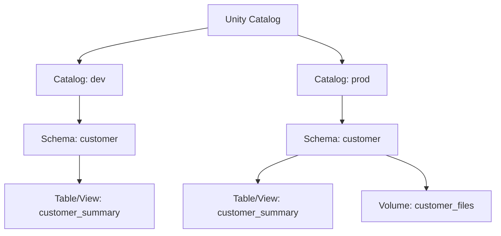
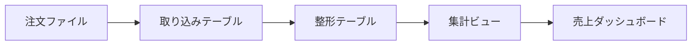

# 音声スクリプト: Unity Catalogを中心としたデータ資産管理

## はじめに

今回は、Databricks Intelligence Platformでデータ資産を管理する中心として、[Unity Catalog](#keyword-unity-catalog)を扱います。前章では、SQL分析、定期ETL、探索的開発に応じてcomputeを選ぶ考え方を見ました。適切なcomputeで処理を実行できても、データ資産を誰が安全に利用できるか、どこに何があるか、数値の根拠をたどれるかは別の論点です。

## 本チャプターのゴール

聞き終わったあとに、Unity Catalogを単なる権限設定の機能ではなく、資産整理、発見可能性、統制、リネージを支える共通基盤として説明できることを目指します。特に、[Catalog](#keyword-catalog)、[Schema](#keyword-schema)、table、view、[Volume](#keyword-volume)を、データ資産を整理する階層として捉えられるようにします。

## 背景

### データ資産管理は、利用ルールを組織で揃えることが鍵

Lakehouseでは、営業、顧客、契約、ログ、機械学習向けファイルなど、さまざまな資産が同じプラットフォーム上で扱われます。便利な一方で、部門ごとに置き場所、命名、所有者、利用ルールがばらばらになると、利用者は正しいデータを見つけにくくなります。

ここで大切なのは、データを保存するだけで終わらせないことです。**データ資産は、見つけられて、意味が分かり、安全に使える状態で管理します。** Unity Catalogは、この状態を組織横断で作るための土台として位置づけます。

## 重要な考え方

### catalog / schema / table・view・volumeで資産を整理する

Unity Catalogでは、資産を階層で整理します。大きな境界をcatalogで表し、その下のschemaで業務領域や用途を分け、さらにtable、view、volumeといった資産を配置します。

次の表は、階層の名前を暗記するためではなく、どの単位で資産を整理するかを考えるために読みます。各行の「役割」と「例」をセットで確認してください。

| 階層・資産   | 役割                                    | 例                                  |
| ------------ | --------------------------------------- | ----------------------------------- |
| Catalog      | 組織、事業領域、環境などの大きな境界    | `prod`, `dev`, `sales`              |
| Schema       | catalog内で業務領域や用途を分類する単位 | `customer`, `contract`, `mart`      |
| Table / View | 分析や処理で参照する表形式の資産        | 注文テーブル、顧客ビュー            |
| Volume       | 表形式ではないファイルを管理する資産    | CSV、JSON、画像、モデル関連ファイル |

この階層を意識すると、開発・検証・本番の資産を混同しにくくなります。たとえば、同じ顧客データを扱う場合でも、`dev.customer`と`prod.customer`のように環境や責務を分けておくと、利用者が文脈を判断しやすくなります。

### table、view、volumeは資産の種類として見る

表形式のデータには、[Managed Table](#keyword-managed-table)や[External Table](#keyword-external-table)があります。この章では、それぞれの詳細な保存場所設計や運用判断には踏み込みません。重要なのは、どちらもUnity Catalog上で管理対象となる表形式の資産として整理される点です。

viewは、利用者に見せたい形でデータを提示する仮想的な表です。元テーブルの構造をそのまま見せるのではなく、分析しやすい列名や集計済みの形で公開する場面があります。

volumeは、表ではないファイルを管理するための資産です。機械学習で使う画像、取り込み前のCSV、JSONファイルなど、テーブル化される前後のファイルも、発見や統制の対象として扱えます。

### 発見可能性、統制、リネージをまとめて考える

Unity Catalogを使う理由は、誰に何を許可するかだけではありません。[Data Discovery](#keyword-data-discovery)により、利用者は必要なデータを探し、説明、所有者、関連資産を確認しやすくなります。[Data Governance](#keyword-data-governance)により、組織のルールに沿って資産を管理しやすくなります。[Data Lineage](#keyword-data-lineage)により、ダッシュボードの数値がどのテーブルや処理から来たかをたどりやすくなります。

**統制は、アクセス制御だけではありません。** 見つけられること、意味が分かること、変更や利用の流れを追えることも、データ資産を安全に活用するための統制です。

## 具体的なイメージ

### 複数部門で営業・顧客・契約データを利用する

営業部門、カスタマーサクセス、経理が同じ顧客や契約データを使う場面を考えます。各部門が別々にコピーを作ると、どれが正しいか分からなくなり、定義のずれも起きやすくなります。

この場合は、catalogやschemaで業務領域を整理し、利用者が共通の資産を見つけられる状態を作ります。必要なデータを探せるだけでなく、所有者や説明が分かると、問い合わせ先や利用判断も明確になります。

### 開発環境と本番環境で同名の資産を扱う

開発中の変換ロジックと本番ダッシュボードが、どちらも`customer_summary`のような名前のテーブルを扱うことがあります。名前だけで判断すると、誤って検証用の資産を本番分析に使う危険があります。

この図では、環境と業務領域を階層で分ける考え方を見ます。実際の命名規約は組織で決めますが、資産がどの文脈に属するかを階層で表すことがポイントです。

**同じ名前の資産ほど、環境と責務で整理します。** catalogやschemaを使って境界を明確にすると、利用者が本番用か検証用かを判断しやすくなります。

### ダッシュボードの数値の根拠をたどる

経営ダッシュボードの売上数値が急に変わった場合、最終的な表示だけを見ても原因は分かりません。元データ、変換処理、中間テーブル、集計ビュー、ダッシュボードまでの流れを確認する必要があります。

次の流れは、リネージを使って数値の根拠をたどるときの見方を簡略化したものです。左から右へ、データがどの資産を通って利用者に届くかを確認します。

このように流れを追えると、影響分析や原因調査がしやすくなります。どのテーブル変更がどのダッシュボードに影響するかを考える場面でも、リネージは重要です。

## 領域7へのつなぎ

この章では、[Principals](#keyword-principals)をユーザー、グループ、サービスプリンシパルなどのアクセス主体として紹介するに留めます。GRANT / REVOKE / DENY、row filter、column mask、ABACの具体実装は扱いません。

ここで学んだ資産管理と統制の考え方は、取り込み、変換、ジョブ運用、CI/CD、性能改善、ガバナンスのすべてに共通する土台になります。詳細なアクセス制御は、後続のガバナンス領域で、どの主体にどの権限を与えるかという実装レベルの判断として学びます。
