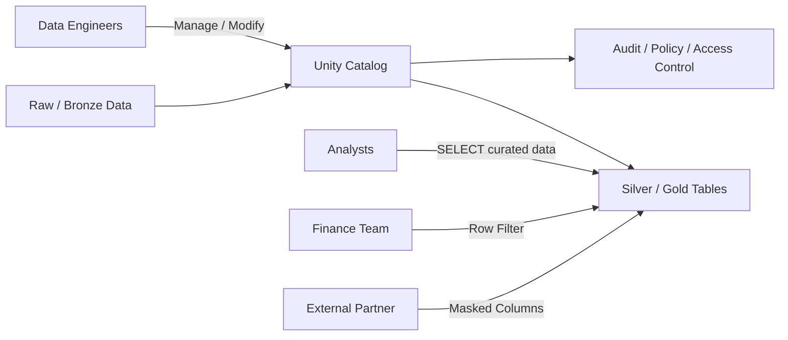

# 音声スクリプト: Governance and Securityの全体像

## はじめに

データ基盤にデータが集まり、分析やAIに使えるようになるほど、次に問われるのは「誰が、どこまで見てよいのか」です。顧客情報、売上情報、契約情報、監査ログのようなデータは、ただ利用可能にするだけでは不十分です。

一方で、厳しく閉じすぎれば、分析や業務改善の速度が落ちます。Governance and Securityは、全拒否か全開放かを選ぶ領域ではありません。必要な人が、必要な範囲で、必要な条件のもと安全にデータを使えるようにするための領域です。

Databricksにおけるガバナンスは、データ活用を止めるための制限ではなく、データ活用のスピードと安全性を両立させるための仕組みとして理解します。

## 本チャプターのゴール

ゴールは、Governance and Securityを「アクセス制御の設定」ではなく、「データ基盤全体を安全に利用可能な状態へ閉じる設計」として説明できるようになることです。

特に、Unity Catalog、managed table / external table、GRANT / REVOKE / DENY、users / groups / service principals、row-level security、column masking、Unity Catalog ABAC policiesを、データ活用と統制を両立するための判断軸として理解します。

## 背景

### データの価値が高まるほど、アクセス制御の重要性も高まる

データ基盤には、業務部門、分析者、データエンジニア、AI開発者、外部委託先など、多様な利用者が存在します。価値の高いデータほど、多くの人が使いたくなりますが、全員が同じ範囲を見てよいとは限りません。

顧客情報、個人情報、契約情報、売上、監査ログは、用途や立場によって見せる範囲が変わります。たとえば、分析者は集計済みのGoldテーブルを見られても、基盤管理権限や個人情報の生値までは不要かもしれません。

### データ基盤では、利用者・用途・データ粒度が多様になる

同じテーブルでも、営業部門は自部門の行だけ、経理部門は金額列を含めて、外部パートナーは個人情報をマスクした状態で見る、といった違いが必要になります。列や行の見え方を利用者ごとに変えたい場面は珍しくありません。

もし権限管理がワークスペースやテーブルごとに分散すると、誰が何にアクセスできるかを把握しづらくなります。手作業による権限付与は、過剰権限や監査漏れにつながります。

### ガバナンスは、統制と活用を両立させるためにある

ガバナンスの目的は、データを使わせないことではありません。統一的なカタログ、権限階層、ポリシー、監査の仕組みを通じて、安全に使える状態を作ることです。

Data Ingestion、Transformation、Jobs、CI/CD、Monitoringで作ってきたデータ基盤は、最後に「誰が、どのデータを、どの条件で使えるか」を統制して初めて、組織全体で安心して使える基盤になります。

## 重要な考え方

### Unity Catalogは、データ資産を一元的に把握し統制する土台

Unity Catalogは、catalog、schema、table、view、volumeなどのデータ資産を統一的に管理する土台です。データの場所、所有者、権限、利用状況、リネージ、監査を一貫して扱いやすくします。

Unity Catalogがあることで、ワークスペースごとに散らばった権限管理ではなく、組織としてどのデータ資産があり、誰が使えるのかを把握しやすくなります。

### 権限は、最小権限と役割単位で設計する

GRANT / REVOKE / DENYは、user、group、service principalに対して権限を制御する基本です。原則として、個人に直接付与するよりも、groupやservice principalを中心に設計します。

最小権限の考え方では、利用者が目的を達成するために必要な範囲だけを許可します。分析者にはSELECTを許可しても、基盤管理やテーブル変更の権限までは不要な場合があります。

### managed tableとexternal tableは、保存場所ではなく管理責任の違い

managed tableは、Databricksがデータとメタデータを一体で管理しやすいテーブルです。一方、external tableは、既存ストレージ、外部システム、共有要件などと結びつく場面で使われます。

違いを「どこに保存されるか」だけで覚えるのではなく、データファイル、メタデータ、削除、共有、既存ストレージとの関係において、誰が何を管理するのかという責任の違いとして理解します。

### row-level securityとcolumn maskingで、必要な範囲だけを見せる

row-level securityは、利用者や所属に応じて見える行を変える考え方です。たとえば、営業担当者には自分の地域の売上だけを見せ、管理者には全体を見せる、といった制御ができます。

column maskingは、メールアドレス、電話番号、個人識別子などの機密列を、必要な利用者にだけ見せるための考え方です。row filterやcolumn maskを使うことで、テーブルを複製して権限別に増やすのではなく、ポリシーで見え方を制御できます。

### ABACは、属性に基づいて統制をスケールさせる

| 観点             | 代表的な仕組み                 | 主な役割                                           |
| ---------------- | ------------------------------ | -------------------------------------------------- |
| データ資産の整理 | Unity Catalog                  | catalog / schema / tableなどを統一管理する         |
| 基本権限         | GRANT / REVOKE / DENY          | user / group / service principalへの権限を制御する |
| 保存管理         | managed table / external table | データとストレージの管理責任を分ける               |
| 行の制御         | row-level security             | 利用者や所属に応じて見える行を変える               |
| 列の制御         | column masking                 | 機密列を伏せて必要な利用だけ許可する               |
| ポリシーの共通化 | ABAC policies                  | 属性ベースでルールを一元化する                     |

ABAC、Attribute-Based Access Controlは、データ分類や利用者属性を使って統制ルールを広げる考え方です。部署、地域、データ分類、機密度、利用目的といった属性に基づき、同じ考え方のルールを多くのデータへ適用しやすくします。

## 具体的なイメージ

### Unity Catalogでデータ利用範囲を統制する



この例では、Raw / BronzeからSilver / Goldへ整えたデータをUnity Catalogで管理します。Data Engineersは基盤を管理し、Analystsはcurated dataを参照し、Finance Teamは自部門の行だけを見て、External Partnerには機密列をマスクして提供します。

### 基本権限を付与するSQL例

```sql
GRANT USE CATALOG ON CATALOG main TO `analysts`;
GRANT USE SCHEMA ON SCHEMA main.sales TO `analysts`;
GRANT SELECT ON TABLE main.sales.gold_daily_sales TO `analysts`;
```

この例は、分析者グループにcatalog、schema、Goldテーブルを参照するための権限を段階的に付与する概念例です。分析者はGoldテーブルを参照できますが、基盤管理権限やテーブル変更権限までは持ちません。

### 機密列をマスクする概念例

```sql
-- 概念例：機密性の高いメールアドレスをマスクする
CREATE FUNCTION main.security.mask_email(email STRING)
RETURN CASE
  WHEN is_account_group_member('sensitive-data-readers') THEN email
  ELSE '***'
END;
```

外部共有や限定利用では、メールアドレスや個人情報列をそのまま見せる必要がないことがあります。テーブルをコピーして権限別に増やすのではなく、row-level securityやcolumn masking、ABAC policiesで利用範囲を制御することで、データ活用と安全性を両立できます。

Governance and Securityは、データを使わせないための壁ではありません。必要な人が必要な範囲で使えるようにし、利用履歴や権限を監査できる状態を作るための仕組みです。

## 次の学習へのつながり

Phase 10では、データ基盤を構成する主要な流れを見てきました。Data Ingestionでは信頼できる入力を作り、Data Transformation and Modelingでは再利用可能なSoIへ整え、Working with Lakeflow Jobsでは処理を運用可能なワークフローにしました。

Implementing CI/CDでは変更を安全に反映し、Troubleshooting, Monitoring, and Optimizationでは稼働品質を維持しました。そしてGovernance and Securityでは、誰が、どのデータを、どの条件で使えるかを統制し、全体を安全に利用可能な状態へ閉じます。

今後は、各領域をさらに深く掘り下げながら、データ品質、運用、権限、モデリングを横断して理解していきます。Databricksのデータエンジニアリングは、単独の機能を覚えるだけでなく、信頼できるデータを安全に届ける一連の設計として捉えることが重要です。
