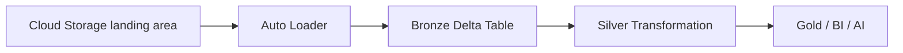

# 音声スクリプト: Data Ingestion and Loadingの全体像

## はじめに

データ取り込みは、**変換、分析、AI活用の前提を作る最初の工程**です。ここでデータを正しく受け入れられないと、その後のSilver / Goldテーブル、Lakeflow Jobsでの運用、[Unity Catalog](#keyword-unity-catalog)によるガバナンスまで不安定になります。

大切なのは、ただファイルやレコードを「読み込む」ことではありません。繰り返し届くデータを、品質、スキーマ、再処理、権限管理まで考えた形で受け入れ、**後続処理が安心して使える状態にすること**です。このチャプターでは、Data Ingestion and Loadingを「入口の作業」ではなく、データ基盤全体の信頼性を決める設計ポイントとして見ていきます。

## 本チャプターのゴール

ゴールは、Data Ingestion and Loadingで問われる**代表的な判断軸を説明できるようになること**です。特に [batch loading](#keyword-batch-loading) / [streaming](#keyword-streaming) / [incremental loading](#keyword-incremental-loading)、[COPY INTO](#keyword-copy-into)、[Auto Loader](#keyword-auto-loader)、[Lakeflow Connect](#keyword-lakeflow-connect)、JDBC / REST、[schema enforcement](#keyword-schema-enforcement) / [schema evolution](#keyword-schema-evolution)、[Unity Catalog](#keyword-unity-catalog) governed tablesを、単語としてではなく「どの状況で選ぶのか」と結び付けて理解します。

試験では、細かな実装手順よりも、**データの到着頻度、データ量、接続元、スキーマ変化、ガバナンス要件から、適切な取り込み方式を選べるか**が重要です。

## 背景

### データ基盤は、入ってくるデータの品質に支配される

Databricksに入ってくるデータソースは一種類ではありません。クラウドストレージ上のCSVやJSON、業務データベース、SaaSアプリケーション、IoTやアプリケーションイベント、ログファイルなど、形式も到着のしかたも異なります。

たとえば、日次で届く小さなマスタファイルと、数分ごとに大量に到着するイベントログでは、**同じ取り込み方式が最適とは限りません**。データ量、到着頻度、変更頻度、スキーマの安定性が違うため、処理方式、再実行方法、エラー時の確認方法も変わります。

### 取り込み方式の選択が、後続の運用コストを左右する

取り込み時にスキーマ変化を考慮していないと、後続のSilver変換で突然カラム不足や型不一致が起きます。重複や欠損を見逃すと、GoldテーブルやBIダッシュボードの集計結果に影響します。監査や再処理に必要な情報を残していなければ、障害時に「どのデータをいつ取り込んだのか」を追跡しづらくなります。

そのため、Data Ingestion and Loadingでは、一回だけ読み込めることより、**繰り返し安全に読み込めること**が重要です。試験でこの領域が独立したセクションとして扱われるのは、取り込みが後続の変換、Jobs運用、品質管理、ガバナンス全体に波及する基礎工程だからです。

## 重要な考え方

### 取り込み方式は、データの性質と運用要件から選ぶ

Databricksでは、**どの取り込み機能が常に最適というわけではありません**。ファイルが一度だけ届くのか、継続的に増えるのか、業務DBやSaaSから取得するのかによって、選ぶべき手段は変わります。

また、**データ量、到着頻度、スキーマ変化、再処理の必要性、ガバナンス要件**も判断材料になります。以下の表は、取り込み方式を選ぶときに見る代表的な軸を整理したものです。

| 判断軸     | 確認すること                             | 代表的な考え方                               |
| ---------- | ---------------------------------------- | -------------------------------------------- |
| 到着頻度   | 一回だけか、定期的か、ほぼリアルタイムか | batch / streaming / incremental loading      |
| データ量   | 少量か、大量ファイルが継続的に届くか     | COPY INTO / Auto Loader                      |
| 接続元     | Cloud storageか、業務SaaSやDBか          | Auto Loader / Lakeflow Connect / JDBC / REST |
| スキーマ   | 固定か、追加・変更が起きるか             | schema enforcement / schema evolution        |
| ガバナンス | 誰がどのデータを使えるべきか             | Unity Catalog governed tablesへの着地        |

batch loadingは、決まったタイミングでまとめてデータを取り込む考え方です。streaming loadingは、継続的に到着するデータを低遅延で処理したい場合に向きます。incremental loadingは、前回から増えた分や変わった分だけを取り込むことで、処理量やコストを抑える考え方です。

COPY INTOは、クラウドストレージ上のファイルを比較的シンプルにDeltaテーブルへロードする場面で理解します。Auto Loaderは、大量のファイルが継続的に到着する場合に、到着ファイルを効率よく検出し、ストリーミング的にBronzeへ取り込む選択肢です。Lakeflow Connectは、SaaSやデータベースなど外部システムとの接続をマネージドに扱いたい場合の選択肢として整理します。JDBCやRESTは、接続先システムのAPIやデータベースから取り込む場合の一般的な接続方式として押さえます。

### 取り込みのゴールは、後続処理が信頼できる状態を作ること

取り込み処理の成果物は、単にファイルを置いた場所ではありません。**後続の変換処理が読みやすく、品質チェックをかけやすく、権限管理や監査ができるテーブルとして着地していること**が重要です。

[schema enforcement](#keyword-schema-enforcement)は、想定しない型やカラムを無制限に受け入れないための考え方です。一方で[schema evolution](#keyword-schema-evolution)は、現実のデータソースで起きるカラム追加などを安全に取り込むための考え方です。どちらも、取り込み時点でデータの信頼性を守るために使います。

最終的に、取り込んだデータは[Unity Catalog](#keyword-unity-catalog)で管理されるテーブルに着地させることで、権限、リネージ、監査、発見性を扱いやすくなります。つまりData Ingestion and Loadingは、**「データを置くこと」ではなく、「組織が安全に使えるデータ資産として受け入れること」**と考えると理解しやすくなります。

## 具体的なイメージ

### クラウドストレージ上のファイルをBronzeへ取り込む

Databricksでの取り込みでは、クラウドストレージ上のファイルをそのまま分析用テーブルとして扱うのではなく、まず[Bronze](#keyword-bronze)層へ取り込み、**監査、再処理、後続変換の起点として保持する構成**がよく使われます。

このとき、取り込み処理はファイルを読むだけではなく、どこから来たデータか、どの時点まで処理したか、後続で安全に利用できるかを管理する役割も持ちます。

以下は、landing領域からBronze、Silver、Goldへ進む基本的な流れです。



この例では、landing領域に到着したファイルをAuto Loaderで検出し、Bronze Delta tableへ継続的に取り込みます。Bronzeは、データソースに近い形で履歴を残す入口です。そこからSilverで型変換、重複排除、品質チェックなどを行い、Goldで利用者向けの集計やBI、AI活用につなげます。

### Auto Loaderで継続取り込みする例

大量のファイルが継続的に到着するケースでは、**毎回すべてのファイルを読み直すのではなく、新しく到着したファイルを追跡しながら取り込む方式**が必要になります。

Auto Loaderは、クラウドストレージに追加されるファイルを継続的に検出し、スキーマ情報や処理済み位置を管理しながらストリーミング取り込みを行うための代表的な仕組みです。

以下は、JSONファイルを読み込み、Bronzeテーブルへ書き込む概念例です。

```python
(
  spark.readStream.format("cloudFiles")
  .option("cloudFiles.format", "json")
  .option("cloudFiles.schemaLocation", "/Volumes/<catalog>/<schema>/<volume>/schemas/orders")
  .load("/Volumes/<catalog>/<schema>/<volume>/landing/orders")
  .writeStream
  .option("checkpointLocation", "/Volumes/<catalog>/<schema>/<volume>/checkpoints/orders")
  .toTable("<catalog>.<schema>.bronze_orders")
)
```

このコード例では、`cloudFiles`でファイル到着を扱います。[`schemaLocation`](#keyword-schema-location)は検出したスキーマ情報を保持する場所、[`checkpointLocation`](#keyword-checkpoint-location)はどこまで処理済みかを管理する場所です。`toTable`は、取り込み結果をDeltaテーブルとして保存する役割を持ちます。これにより、この処理は**単発のファイル読み込みではなく、継続運用を前提にした取り込み**として扱えます。

Auto Loaderは大量・継続ファイル取り込みで有効です。一方、単発または比較的単純なファイルロードならCOPY INTOが適している場合があります。SaaSや業務DBから継続的に取り込みたい場合はLakeflow Connectを検討し、特定システムからSQLやAPIで取得する場合はJDBCやRESTのような接続方式を使うこともあります。重要なのは、ツール名を暗記することではなく、**データの性質と運用要件から選び分けること**です。

## 次の学習へのつなぎ

Data Ingestion and Loadingで重要なのは、単にデータを読み込めることではありません。**データが一度だけ届くのか、継続的に届くのか、ファイル、データベース、SaaSなどどこから取り込むのか、データ量や到着頻度はどの程度か、スキーマ変化や品質確認をどう扱うか、再処理や監査の起点をどう残すかを踏まえて、適切な取り込み方式を選べること**です。

取り込みによって[Bronze](#keyword-bronze)層にデータを受け入れた後も、そのままでは分析や業務利用に十分とは限りません。次のチャプターでは、取り込んだデータを品質、粒度、意味の面から整え、再利用可能な情報へ変えるData Transformation and Modelingを学びます。
