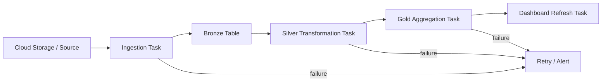

# 音声スクリプト: Working with Lakeflow Jobsの全体像

## はじめに

NotebookやSQLで処理が一度成功しただけでは、データ基盤は運用できません。毎日決まった時刻に動くのか、ファイルが到着したら動くのか、途中で失敗したらどこからやり直すのか。本番のデータ処理では、コードの中身と同じくらい、**処理をどう回し続けるか**が重要です。

[Lakeflow Jobs](#keyword-lakeflow-jobs)は、Notebook、SQL、パイプライン、ダッシュボードといった個別の処理を、依存関係と運用ルールを持つ一つのワークフローとして組み立てるための仕組みです。**Lakeflow Jobsは、個別の処理を運用可能なワークフローへ変える仕組み**として捉えます。

## 本チャプターのゴール

このチャプターでは、Lakeflow Jobsで問われる代表的な判断軸を説明できるようになることを目指します。

特に、[task](#keyword-task)の分割、[DAG](#keyword-dag)での依存関係、[task dependency](#keyword-task-dependency)、[retry](#keyword-retry)、[trigger](#keyword-trigger)、[schedule](#keyword-schedule)、[file arrival](#keyword-file-arrival)、[table update](#keyword-table-update)、[branching](#keyword-branching)、[looping](#keyword-looping)を、どの運用課題を解くための要素なのかで整理します。

## 背景

### 単発実行の成功は、運用の成功ではない

取り込みや変換の処理を正しく作れても、それを決まった条件で継続的に動かせなければ、データ基盤としては運用できません。上流の取り込みが失敗しているのに下流の変換だけが動くと、不完全なデータや古いデータをもとにテーブルやダッシュボードが作られる可能性があります。

Notebookを手動で順番に実行すれば、一度は成功するかもしれません。しかし本番運用では、毎日、毎時、あるいはデータ到着のたびに同じ品質で処理を回す必要があります。手動実行中心の運用は、**属人化、実行漏れ、障害復旧の遅延**につながります。

### データパイプラインには、順番・失敗・到着待ちを扱う仕組みが必要

データパイプラインでは、上流が成功してから下流を実行する、失敗したタスクだけ再実行する、外部システムの一時的な失敗ならretryする、ファイル到着やテーブル更新を待ってから起動する、といった運用ルールが必要です。

起動条件も一つではありません。毎日決まった時刻に動かす処理もあれば、ファイルが到着したら動かす処理、前提テーブルが更新されたら動かす処理もあります。Lakeflow Jobsが試験の独立セクションとして扱われるのは、**運用ルールを設計できることが、信頼できるデータ基盤に直結する**からです。

## 重要な考え方

### ジョブは、処理を順番に実行するだけの機能ではない

Lakeflow Jobsは、複数の処理をただ並べるだけの機能ではありません。どの処理をどの単位でタスクにするか、どの順序で実行するか、失敗時にどう復旧するか、何を契機に開始するかを定義する**運用の設計図**です。

| 判断観点   | 考えること                         | 代表的な選択肢                          |
| ---------- | ---------------------------------- | --------------------------------------- |
| タスク分割 | 何を独立した責務として分けるか     | Notebook / SQL / Pipeline / Dashboard   |
| 実行順序   | どの処理が先に終わる必要があるか   | DAG-based task graph                    |
| 障害対応   | 失敗時にどう復旧するか             | retries / failed task rerun             |
| 分岐       | 状況により処理を変える必要があるか | conditional tasks / branching           |
| 繰り返し   | 同じ処理を複数対象に実行するか     | looping                                 |
| 起動条件   | 何を契機に動かすか                 | scheduled / file arrival / table update |

### DAGで依存関係を明示する

DAG、つまり有向非巡回グラフは、タスク間の依存関係を表します。たとえば、Ingestion Taskが成功してからSilver Transformation Taskを実行し、その後にGold Aggregation TaskやDashboard Refresh Taskを実行する、といった順序を明示できます。

DAGがあると、処理順序が可視化され、障害時にどこで止まったのか、どの下流タスクに影響するのかを判断しやすくなります。task dependencyは、**データの前提条件をワークフロー上に表現するための重要な考え方**です。

### タスクは責務単位で分ける

1つの巨大Notebookに取り込み、変換、集計、通知まで詰め込むと、失敗箇所の特定や部分再実行が難しくなります。Jobsの設計では、**責務ごとにタスクを分けること**が重要です。

Notebook taskはPythonやSQLを含む処理の実行、SQL taskはクエリやダッシュボード更新、pipeline taskは宣言的なパイプライン処理、dashboard taskは利用者向け成果物の更新など、役割に応じて選びます。タスクを分けることで、履歴、失敗、再実行、所有範囲を管理しやすくなります。

### 再試行・条件分岐・ループで運用上の例外を扱う

retryは、単なる失敗回避ではありません。外部サービスの一時的な応答遅延、クラスタ起動の揺らぎ、一時的なリソース不足のように、再実行すれば成功する可能性がある問題への耐性を持たせるための設計です。

conditional tasksやbranchingは、データ件数がゼロの場合は後続処理をスキップする、検証結果に応じて通知を出す、といった判断に使います。loopingは、複数の対象テーブルやパラメータに対して同じ処理を繰り返したい場合に考えます。重要なのは、**例外を人の手順ではなくワークフローのルールとして扱うこと**です。

### トリガーは時間ではなく、データの準備状況から選ぶ

triggerは「毎日9時」のような時間基準だけで選ぶものではありません。**データが届いたか、前提テーブルが更新されたか、利用者が必要とするタイミングはいつか**という観点で選びます。

scheduled triggerは定期実行に向きます。file arrival triggerは、クラウドストレージなどにファイルが到着したことを契機にできます。table update triggerは、前提となるテーブル更新に合わせて下流を動かしたい場合に考えます。

## 具体的なイメージ

### 典型的なデータパイプラインをJobsで運用する

この図では、タスクを責務ごとに分け、依存関係で実行順を制御する意味を見ます。Ingestion、Transformation、Aggregation、Dashboard Refreshを別タスクにすることで、どこで失敗したか、どこから再実行すべきかを判断しやすくなります。



この図では、Ingestion、Transformation、Aggregation、Dashboard Refreshを別タスクとして分けています。上流が成功してから下流を実行するため、不完全な状態でGoldやダッシュボードが更新されるリスクを下げられます。

### ジョブ定義のイメージ

Jobs定義は、処理コードの代替ではありません。NotebookやSQLなどのコードを、いつ、どの順序で、どの依存関係で実行するかを管理する設定です。次の例では、取り込み、変換、集計を順番に実行するワークフローとして表現しています。

```yaml
resources:
  jobs:
    daily_sales_pipeline:
      name: daily-sales-pipeline
      tasks:
        - task_key: ingest_orders
          notebook_task:
            notebook_path: ../src/ingest_orders.py

        - task_key: transform_orders
          depends_on:
            - task_key: ingest_orders
          notebook_task:
            notebook_path: ../src/transform_orders.py

        - task_key: build_sales_summary
          depends_on:
            - task_key: transform_orders
          sql_task:
            query:
              query_id: <query-id>
```

この例は概念理解用です。重要なのは、処理コードそのものではなく、タスク分割、depends_onによるtask dependency、上流成功後に下流を実行する設計が見えることです。

Lakeflow Jobsでは、実行履歴とDAGを見ることで、どのタスクで詰まったのかを確認できます。失敗したタスクを追跡し、必要に応じてretryやfailed task rerunを行えるため、全体を手動でやり直す運用よりも安全で再現性があります。Jobsはデータ処理コードの代替ではなく、**コードを運用可能なワークフローへ包む役割**を持ちます。

## 次の学習へのつなぎ

Lakeflow Jobsで処理を運用可能なワークフローにしても、変更を安全に環境へ反映できなければ、安定した運用は続きません。**ジョブやノートブックなどの定義をGitで管理し、dev / stg / prodへ安全に反映すること**が次のテーマです。

次のチャプターでは、手作業で本番へ反映するのではなく、レビュー、テスト、自動デプロイを通じて変更を管理するImplementing CI/CDを学びます。
