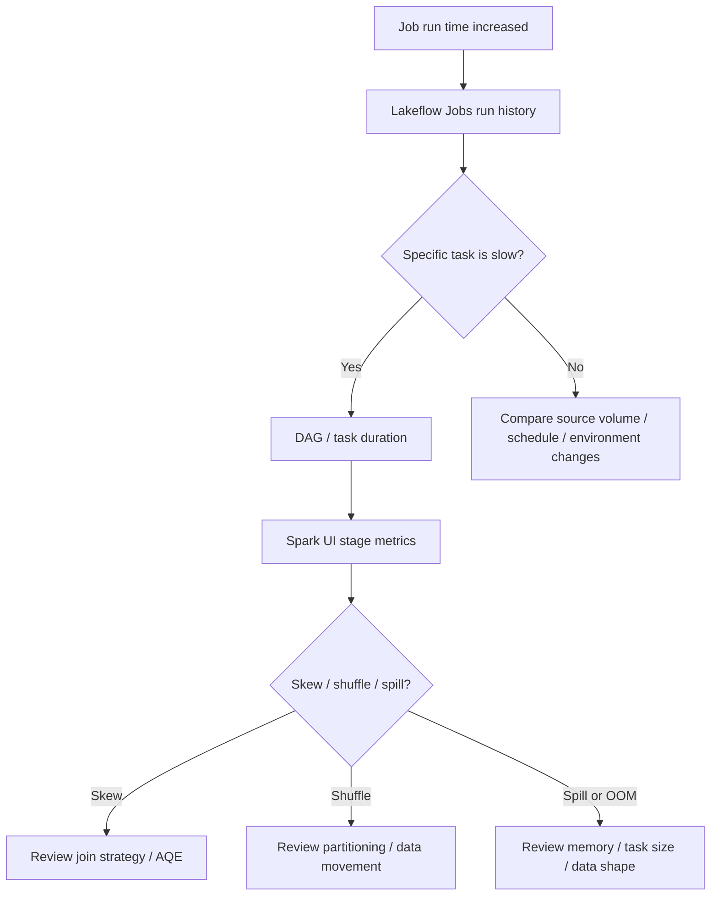

# 音声スクリプト: Troubleshooting, Monitoring, and Optimizationの全体像

## はじめに

データパイプラインは、最初に一度成功しただけでは安心できません。昨日まで30分で終わっていた処理が、データ量の増加や偏ったキーの混入によって数時間かかることがあります。成功しているように見えても、再試行が増え、コストが上がり、利用者が待つ時間が長くなっているかもしれません。

Databricksにおける運用では、失敗したかどうかだけでなく、どこが遅くなったのか、何が変わったのか、次にどの手を打つべきかを見抜く力が必要です。Troubleshooting, Monitoring, and Optimizationは、データ基盤を止めず、遅くせず、安心して使い続けるための技術を扱う領域です。

## 本チャプターのゴール

ゴールは、データ基盤の問題を「失敗したかどうか」だけでなく、実行時間、依存関係、Sparkのステージ、データ分布、クラスタ、テーブル設計まで含めて観測できるようになることです。

特に、Lakeflow Jobs run history、DAG、Spark UI、data skew、shuffle、disk spilling、OOM、Liquid Clustering、predictive optimizationを、問題の切り分けと改善の判断軸として理解します。

## 背景

### データ基盤の問題は、失敗だけでなく「遅くなる」形でも現れる

運用中のデータ基盤では、エラーで止まる問題だけが障害ではありません。実行時間の増加、部分失敗、再試行回数の増加、クラスタコストの増加、下流データ更新の遅延も問題です。

データ量や分布は日々変わります。同じコードでも、特定キーにデータが偏ったり、入力ファイル数が急増したり、スキーマが変わったりすると、性能や安定性が変わります。昨日成功した処理が、今日も同じように成功するとは限りません。

### 分散処理では、原因がコードの一行に閉じない

Sparkの処理では、shuffle、data skew、disk spilling、OOMのような分散処理特有の問題が起きます。コードの一行だけを見ても、どのステージでデータ移動が増えたのか、どのタスクだけ極端に遅いのかは分かりません。

上流タスクの遅延は、DAG上の下流タスク全体へ波及します。あるタスクが遅くなった結果、Goldテーブルの更新が遅れ、ダッシュボードやAI処理の開始も遅れることがあります。そのため、ジョブ全体ではなく、どこで詰まったのかを観測する必要があります。

### 運用技術は、データ利用者への約束を守るためにある

分析者や業務部門にとって重要なのは、データがあるか、いつ更新されるか、信頼できる状態かです。運用チームにとっての成功は、ジョブが一度動くことではなく、利用者が必要なタイミングで正しいデータを使える状態を維持することです。

そのため、Lakeflow Jobs run history、DAG、Spark UI、メトリクス、ログを使って観測し、問題を早く検知し、原因を切り分け、再発しにくい形へ改善することが重要です。

## 重要な考え方

### まず「何が変わったか」を把握する

監視は、成功/失敗を見るだけではありません。run historyでは、過去実行との比較から実行時間、再試行回数、失敗頻度、開始時刻、タスクごとの所要時間の変化を確認します。

データ量が増えたのか、入力データの分布が変わったのか、クラスタ設定が変わったのか、ライブラリやNotebookの変更が入ったのかを切り分けます。トラブルシューティングの第一歩は、問題そのものよりも「いつから何が変わったか」を把握することです。

### ジョブ全体ではなく、失敗または遅延した地点を特定する

Lakeflow JobsのDAGやtask durationを見ると、どの依存タスクがボトルネックになっているかを確認できます。ジョブ全体が遅いように見えても、実際には上流の一つのタスクだけが遅く、その後ろにある下流タスクが待っているだけかもしれません。

失敗時も同じです。全体をやり直す前に、失敗したタスク、依存関係、入力データ、設定値、直前の変更を確認します。failed task rerunやretryを使う判断も、どこで失敗したかを理解してから行います。

### Spark UIでは、ステージごとの偏りとデータ移動を見る

Spark UIでは、ステージ単位でshuffle read、shuffle write、task duration、spill、失敗タスク、入力サイズの偏りを確認します。特定ステージだけ極端に遅い場合、data skewや大きなshuffleが疑われます。

Max task durationだけが長い、Max shuffle readだけが大きい、spillが多いといった偏りは、全体平均では見えにくい問題です。Spark UIは、分散処理のどこに偏りやデータ移動があるかを確認するための重要な入口です。

### 最適化は、推測ではなく再計測まで含めて完了する

設定を変えれば必ず速くなるわけではありません。shuffle partitionsを変える、AQEを有効にする、join戦略を見直す、repartitionする、Liquid Clusteringやpredictive optimizationを検討する、といった対処は、観測結果に基づいて選びます。

最適化は、変更して終わりではありません。変更前と変更後のrun history、DAG、Spark UIを比較し、実行時間、shuffle、spill、コスト、失敗率がどう変わったかを再計測して初めて完了します。

### 運用改善は、コード・データ・クラスタ・テーブル設計を横断して考える

| 症状                       | 最初に見る場所            | 代表的な原因                         | 主な対処の方向                              |
| -------------------------- | ------------------------- | ------------------------------------ | ------------------------------------------- |
| ジョブ失敗                 | Lakeflow Jobs run history | タスク失敗、依存関係、設定不備       | エラー詳細、再試行、依存関係確認            |
| 一部タスクだけ遅い         | DAG / task duration       | 上流遅延、データ偏り                 | 遅いタスクと前後関係を確認                  |
| 特定ステージだけ極端に遅い | Spark UI                  | data skew、shuffle増大               | AQE、join戦略、repartition検討              |
| ディスク使用量が大きい     | Spark UI                  | disk spilling、メモリ不足            | パーティション、メモリ、処理設計確認        |
| OOM                        | cluster / task logs       | 大きすぎる処理、偏り、ライブラリ競合 | 処理分割、設定、依存関係確認                |
| 継続的に性能悪化           | run history               | データ増加、設計劣化                 | 実行時間比較、Liquid Clustering、最適化検討 |

問題はコードだけにあるとは限りません。入力データ、キーの偏り、クラスタサイズ、ライブラリ、テーブルレイアウト、権限、スケジュールのすべてが影響します。運用改善では、これらを横断して考えることが重要です。

## 具体的なイメージ

### ジョブ遅延が発生したときの調査フロー



まずJob run historyで、いつから実行時間が悪化したかを確認します。次にDAGで遅いタスクと前後関係を見ます。さらにSpark UIで、特定ステージのMax shuffle readだけが大きい、task durationが一部だけ長い、spillが発生している、といった偏りを確認します。

### Spark UIの観測から設定を検討する例

```python
spark.conf.set("spark.sql.shuffle.partitions", "400")
spark.conf.set("spark.sql.adaptive.enabled", "true")
spark.conf.set("spark.sql.adaptive.skewJoin.enabled", "true")
```

`spark.sql.shuffle.partitions`は、shuffle後の並列度に影響します。AQEやskew join handlingは、実行時に見えた偏りへ対処する手段になります。ただし、設定値を暗記したり、増やせば速くなると考えたりするのは危険です。観測結果に基づき、変更後に必ず再計測します。

たとえば、Job run historyで実行時間の悪化を見つけ、DAGでSilver変換タスクが遅いことを確認し、Spark UIで特定ステージのMax shuffle readだけが大きいことを見つけたとします。この場合はskewを疑い、AQEやjoin設計、repartitionを見直します。その後、再実行して実行時間、shuffle、spillが改善したか確認します。

Liquid Clusteringやpredictive optimizationは、テーブル設計や保守の観点から性能を支えます。処理コードだけでなく、テーブルがどのように配置・保守されているかも、継続的な性能に影響します。

## 次の学習へのつながり

Troubleshooting, Monitoring, and Optimizationでは、データ基盤を安定して動かし続けるために、実行履歴、DAG、Spark UI、メトリクスを使って問題を観測し、改善する方法を学びました。

次のGovernance and Securityでは、誰が何を実行したか、どのデータにアクセスしたか、どの権限で運用しているかを扱います。監視やトラブルシューティングでは、実行者、アクセス対象、権限、監査ログを確認する場面があります。

パフォーマンスや障害対応だけでは、信頼できるデータ基盤は完成しません。安定した運用に加えて、権限、監査、データ保護を組み合わせることで、利用者が安心して使える基盤になります。
