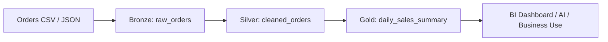

# 音声スクリプト: Data Transformation and Modelingの全体像

## はじめに

取り込んだデータは、そのままでは多くの場合「使える情報」ではありません。業務システムごとに形式やコード体系が異なり、欠損や重複があり、分析したい単位とも一致しないことがよくあります。

[SoR](#keyword-sor)、つまりSystem of Recordは、元システムの業務処理のために作られたデータです。一方で、分析、BI、AI、業務改善で再利用しやすい形に整えたデータは[SoI](#keyword-soi)、System of Insightとして考えると理解しやすくなります。

**Data Transformation and Modelingは、SoRとしての生データを、再利用可能なSoIへ育てる工程**です。問われるのは[PySpark](#keyword-pyspark)や[SQL](#keyword-sql)の文法だけではありません。**品質、粒度、意味、再利用性、利用者に渡すデータ契約をどう設計するか**が重要です。

## 本チャプターのゴール

ゴールは、Data Transformation and Modelingを「データを加工する作業」ではなく、**使える情報へ変える設計工程**として説明できるようになることです。

特に、SoRとSoIの違い、[メダリオンアーキテクチャ](#keyword-medallion-architecture)における[Bronze](#keyword-bronze) / [Silver](#keyword-silver) / [Gold](#keyword-gold)の責務分担、PySparkやSQLによる変換、[join](#keyword-join) / union / explode / filter、[deduplication](#keyword-deduplication) / [aggregation](#keyword-aggregation)、data quality checks、[materialized view](#keyword-materialized-view) / [streaming table](#keyword-streaming-table)を、後続のBI、分析、AI、業務利用にどうつながるかで整理します。

## 背景

### 取り込んだだけのデータは、分析にそのまま使えない

SoRは、元システムが業務処理を正しく行うために作られています。受注システム、在庫システム、顧客管理システムなどは、それぞれの業務に最適化されたID、名称、日付、状態、コード体系を持っています。

しかし、分析やAI、横断的な業務改善で必要になる粒度や意味は、元システムの都合と一致しないことが多いです。複数システムをまたぐと、同じ顧客を指すIDが違ったり、日付の意味が注文日、出荷日、計上日で異なったり、状態コードの定義が部門ごとに違ったりします。

### 変換とモデリングの設計が、データ利用の速度と信頼性を決める

変換が不足していると、BIレポートごとに独自の加工が増えます。その結果、同じ「売上」でもダッシュボードごとに集計定義が違い、利用者がどれを信じればよいか分からなくなります。

モデリングが不足していると、特定用途だけに作られた再利用しづらい集計テーブルが増えます。短期的には早く見えても、利用者や分析テーマが増えるたびに似たテーブルを作り直すことになり、運用コストが上がります。

そのため、Bronze / Silver / Goldの責務分担、品質チェック、利用者向けのデータ契約が重要になります。Data Transformation and Modelingが独立した試験セクションになるのは、**データ利用の速度、信頼性、再利用性を決める中心的な工程**だからです。

## 重要な考え方

### SoRからSoIへ、データの役割を変える

SoRとSoIを比較する目的は、単語を覚えることではありません。**元システムの都合で作られたデータを、利用者が同じ意味で再利用できる情報へ変える**という役割の違いを理解することです。次の表では、両者の違いを目的、粒度、品質、利用者の観点で整理します。

| 観点     | SoR寄りのデータ        | SoIとして整えたデータ          |
| -------- | ---------------------- | ------------------------------ |
| 目的     | 元システムの業務処理   | 分析・AI・横断利用             |
| 粒度     | システム都合           | 利用目的に合わせる             |
| 品質     | 原則そのまま保持       | 欠損・重複・型・コードを整える |
| 結合     | システム内前提         | 複数データをつなぐ             |
| 利用者   | 元システムの利用者     | BI、分析、AI、業務部門         |
| 変更影響 | 元システムの変更に従う | 利用者向けの契約を維持する     |

SoIのモデリングは、単一の正解テーブルを一つ作ることではありません。用途に応じて再利用可能な意味を提供し、利用者が同じ前提でデータを扱えるようにすることです。

### メダリオンアーキテクチャは、品質と責務を段階的に分ける考え方

Databricksでは、生データを一度に完成形へ変えるのではなく、**品質や用途に応じて段階的に整える考え方**を使います。これがメダリオンアーキテクチャです。

Bronze / Silver / Goldは、単なる処理順ではありません。**データの責務と品質水準を分ける設計**です。どの層に何を残し、どの層で何を標準化し、どの層を利用者へ提供するかを分けることで、再処理、品質改善、利用者向けの変更管理をしやすくします。

### Bronze / Silver / Goldは、処理順ではなく責務の分離

Bronzeは、証跡と再処理の起点として、生に近いデータを保持する層です。取り込み元の状態をできるだけ残すことで、後からロジックを修正したり、障害時に再処理したりしやすくなります。

Silverは、品質、型、重複、結合可能性を整える層です。欠損の扱い、型変換、コードの標準化、重複排除、キーの整理などを行い、複数の用途で再利用しやすいデータへ近づけます。

Goldは、BI、分析、AIなどの利用者に渡すためのデータプロダクトに近い層です。単なる最終集計ではなく、**利用者が期待する粒度、意味、更新頻度、品質を満たす契約**として考えます。

### 変換処理は、品質・粒度・再利用性を同時に設計する

PySparkやSQLでfilter、join、union、explode、aggregationを使うこと自体が目的ではありません。**どの行を残すのか、どのキーで結合するのか、どの粒度で集計するのかを設計すること**が重要です。

deduplicationは、同じ事実を二重に数えないための品質設計です。aggregationは、利用者が見る粒度へ意味をまとめる設計です。data quality checksは、欠損、範囲外の値、参照不整合などを早く見つけ、信頼できないデータを下流へ流し続けないための仕組みです。

### Goldは用途別の最終集計ではなく、利用者に渡すための契約

Goldテーブルは、ダッシュボードごとの一時的な集計置き場ではありません。利用者に対して「この定義で、この粒度で、この品質のデータを提供する」という契約に近い存在です。

そのため、Goldを作るときは、列名、粒度、更新頻度、指標定義、権限、参照される期間、変更時の影響を考えます。データモデリングは、**利用者にとって意味が安定したインターフェースを作る作業**でもあります。

## 具体的なイメージ

### BronzeからSilver、Goldへ整える流れ

この図では、各層を分ける目的を見ます。Bronzeは取り込み元に近い証跡、Silverは品質と結合可能性を整えた再利用層、GoldはBIやAIなどの利用者へ渡す提供層として考えます。



Bronzeは、生データ、証跡、再処理の起点です。Silverは、型変換、欠損除去、重複排除、結合しやすいキーの整備などで品質を整える層です。Goldは、利用者にとって意味のある集計、ビュー、テーブルを提供する層です。

### PySparkでSilverを作る簡易例

Silver化では、生データをただ書き換えるのではなく、後続が安全に使えるように品質と型を整えます。ここでは、注文IDの欠損除去、日付と金額の型変換、重複排除を行い、Silverテーブルとして保存する流れを見ます。

```python
from pyspark.sql import functions as F

bronze = spark.table("main.sales.bronze_orders")

silver = (
    bronze
    .filter(F.col("order_id").isNotNull())
    .withColumn("order_date", F.to_date("order_timestamp"))
    .withColumn("amount", F.col("amount").cast("decimal(18,2)"))
    .dropDuplicates(["order_id"])
)

silver.write.mode("overwrite").saveAsTable("main.sales.silver_orders")
```

この例では、Bronzeの注文データから、注文IDがない行を除外し、日付と金額の型を整え、重複を排除してSilverテーブルとして保存しています。コードの細部を覚えることより、なぜその変換が必要なのかを理解することが大切です。

Databricksでの変換は、単にDataFrame操作をすることではありません。後続のBI、分析、AI、業務利用が、同じ意味と品質でデータを使えるように、**データの利用可能性を高める工程**です。

## 次の学習へのつなぎ

変換・モデリングでデータを使える形に整えても、その処理を継続的に動かせなければデータ基盤として運用できません。**Bronze / Silver / Goldへの処理を、依存関係、再試行、実行履歴を持つワークフローとして運用すること**が次のテーマです。

次のチャプターでは、取り込み、Silver変換、Gold生成、品質チェックを手作業ではなく継続的に回すために、Working with Lakeflow Jobsを学びます。
