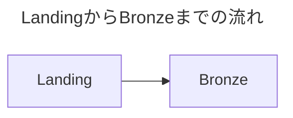

# DEA Audio Learn 教材表現 執筆ガイド

このガイドは、DEA Audio Learn の音声教材本文と要点メモで、Markdown 表・コードブロック・Mermaid ソースを安全に扱うための執筆ルールです。

## 対象

- `dea-audio-learn/audio-scripts/*.md` の音声教材本文
- `dea-audio-learn/notes/*.md` の要点メモ

## 基本ルール

1. 表・コード・図の直前に「何を見るか」を説明します。
2. 表・コード・図の直後に「何を理解すべきか」を文章で補足します。
3. コードフェンスでは必ず言語を明示します。
   - Python 例: <code>```python</code>
   - SQL 例: <code>```sql</code>
   - YAML 例: <code>```yaml</code>
   - Mermaid 例: <code>```mermaid</code>
4. Mermaid は `flowchart` を正式対応図式とし、`accTitle` と `accDescr` で図解の目的・関係性を説明します。
5. Mermaid が描画されない環境でも、前後の説明文だけで要点が分かるようにします。
6. コード内の長い行は、UI都合で不自然に改行せず、設定値やメソッドチェーンのまとまりが分かる形を保ちます。
7. 表・コード・Mermaid ソースは読み上げ対象に含めない前提で、重要な結論は本文にも書きます。
8. コードだけを読めば結論が分かる構成にはせず、コードの前後に「何を見るか」と「何を理解すべきか」を本文で補足します。

## DOM 契約

Markdown 描画後、教材本文と要点メモの表現には次の `data-*` 属性が付与されます。後続の可読性改善や E2E は、この属性を安定した識別子として利用します。

| 表現               | 対象DOM               | 属性                                                                                    |
| ------------------ | --------------------- | --------------------------------------------------------------------------------------- |
| Markdown 表        | `table`               | `data-learning-content-kind="table"`                                                    |
| 通常コード         | `pre` と `pre > code` | `data-learning-content-kind="code"`                                                     |
| 言語指定付きコード | `pre` と `pre > code` | `data-code-language="python"` など                                                      |
| Mermaid ソース     | `pre` と `pre > code` | `data-learning-content-kind="mermaid-source"`、`data-code-language="mermaid"`           |
| Mermaid 図解       | `figure`              | `data-learning-content-kind="mermaid"`、`data-mermaid-state="rendered"` または `failed` |

既存の `language-*` クラスは維持します。Mermaid 図解は図解専用コンテナ内だけで横スクロールし、元のソースは折りたたみ領域に保持します。

## 推奨パターン

表の前後には、読む目的と理解すべき結論を置きます。

### Markdown 表の書き方

- 見出しセルは短くし、各列で比較する軸を明確にします。
- 1セルへ長文を詰め込みすぎず、補足や結論は表の後の本文へ置きます。
- 比較対象が多い場合も列を省略せず、表の分割または本文と複数表への再設計を検討します。
- モバイルでは表カード内だけを横スクロールして読むため、列同士の比較関係を保てる Markdown 表として書きます。

```markdown
次の表では、取り込み方式を選ぶときに見る代表的な軸を整理します。

| 判断軸   | 確認すること         |
| -------- | -------------------- |
| 到着頻度 | 一回だけか、継続的か |

この表では、ツール名よりもデータの性質と運用要件から選ぶことが重要です。
```

コードの前後にも、実装詳細ではなく概念例として見る点を補足します。
長いコード行はコードカード内で横スクロールして確認できるため、教材本文側では意味のない途中改行を入れません。

````markdown
以下は、JSONファイルを読み込み、Bronzeテーブルへ書き込む概念例です。

```python
spark.readStream.format("cloudFiles")
```

この例では、ファイル到着を継続的に追跡し、処理済み位置を管理する点を押さえます。
````

Mermaid の前後には、図がなくても関係性を理解できる説明を書きます。

````markdown
次の図は、landing領域からBronze、Silver、Goldへ進む基本的な流れです。



この流れでは、Bronzeを監査と再処理の起点として残すことが重要です。
````
