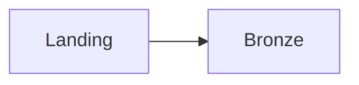

# DEA Audio Learn 教材表現 執筆ガイド

このガイドは、DEA Audio Learn の音声教材本文と要点メモで、Markdown 表・コードブロック・Mermaid ソースを安全に扱うための執筆ルールです。

## 対象

- `dea-audio-learn/audio-scripts/*.md` の音声教材本文
- `dea-audio-learn/notes/*.md` の要点メモ

## 基本ルール

1. 表・コード・図の直前に「何を見るか」を説明します。
2. 表・コード・図の直後に「何を理解すべきか」を文章で補足します。
3. コードフェンスでは必ず言語を明示します。
   - Python 例: <code>```python</code>
   - SQL 例: <code>```sql</code>
   - YAML 例: <code>```yaml</code>
   - Mermaid 例: <code>```mermaid</code>
4. Mermaid は本Issueの範囲では図へ変換せず、Mermaid ソースとして掲載します。
5. Mermaid が描画されない環境でも、前後の説明文だけで要点が分かるようにします。
6. 表・コード・Mermaid ソースは読み上げ対象に含めない前提で、重要な結論は本文にも書きます。

## DOM 契約

Markdown 描画後、教材本文と要点メモの表現には次の `data-*` 属性が付与されます。後続の可読性改善や E2E は、この属性を安定した識別子として利用します。

| 表現               | 対象DOM               | 属性                                                                          |
| ------------------ | --------------------- | ----------------------------------------------------------------------------- |
| Markdown 表        | `table`               | `data-learning-content-kind="table"`                                          |
| 通常コード         | `pre` と `pre > code` | `data-learning-content-kind="code"`                                           |
| 言語指定付きコード | `pre` と `pre > code` | `data-code-language="python"` など                                            |
| Mermaid ソース     | `pre` と `pre > code` | `data-learning-content-kind="mermaid-source"`、`data-code-language="mermaid"` |

既存の `language-*` クラスは維持します。表示スタイル、横スクロール、コピー操作、Mermaid の SVG 描画はこの契約には含めません。

## 推奨パターン

表の前後には、読む目的と理解すべき結論を置きます。

```markdown
次の表では、取り込み方式を選ぶときに見る代表的な軸を整理します。

| 判断軸   | 確認すること         |
| -------- | -------------------- |
| 到着頻度 | 一回だけか、継続的か |

この表では、ツール名よりもデータの性質と運用要件から選ぶことが重要です。
```

コードの前後にも、実装詳細ではなく概念例として見る点を補足します。

````markdown
以下は、JSONファイルを読み込み、Bronzeテーブルへ書き込む概念例です。

```python
spark.readStream.format("cloudFiles")
```

この例では、ファイル到着を継続的に追跡し、処理済み位置を管理する点を押さえます。
````

Mermaid の前後には、図がなくても関係性を理解できる説明を書きます。

````markdown
次の図は、landing領域からBronze、Silver、Goldへ進む基本的な流れです。



この流れでは、Bronzeを監査と再処理の起点として残すことが重要です。
````
