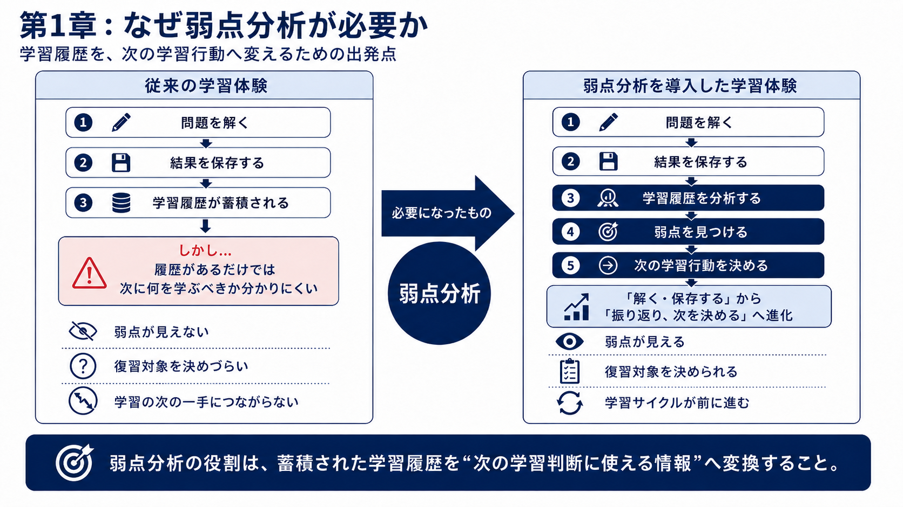
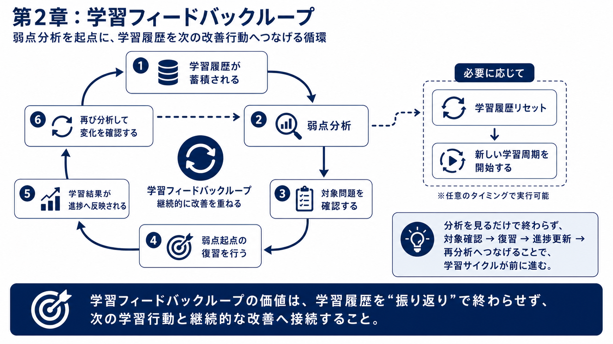
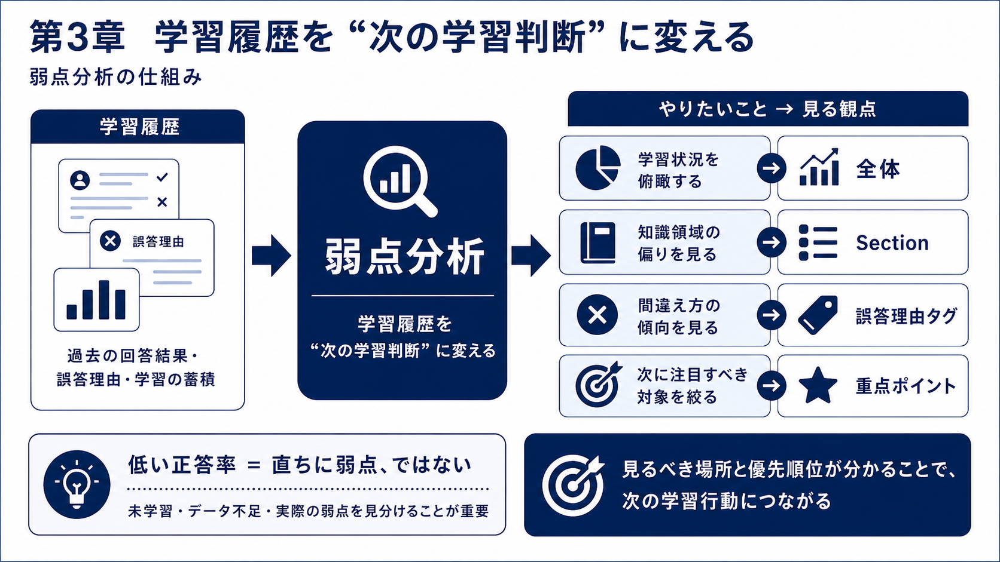
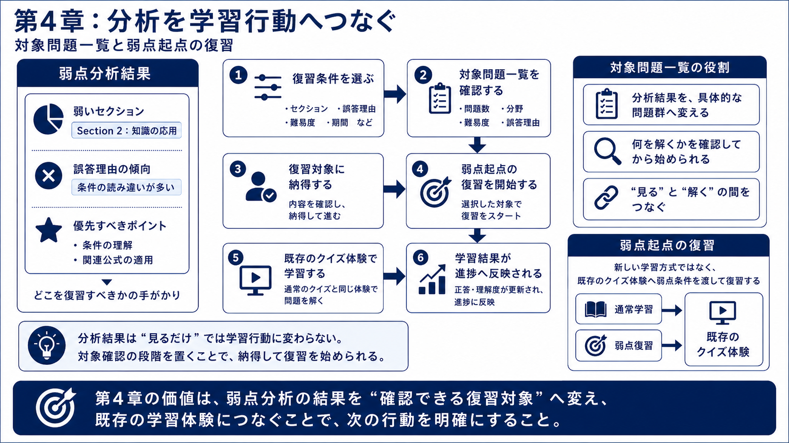
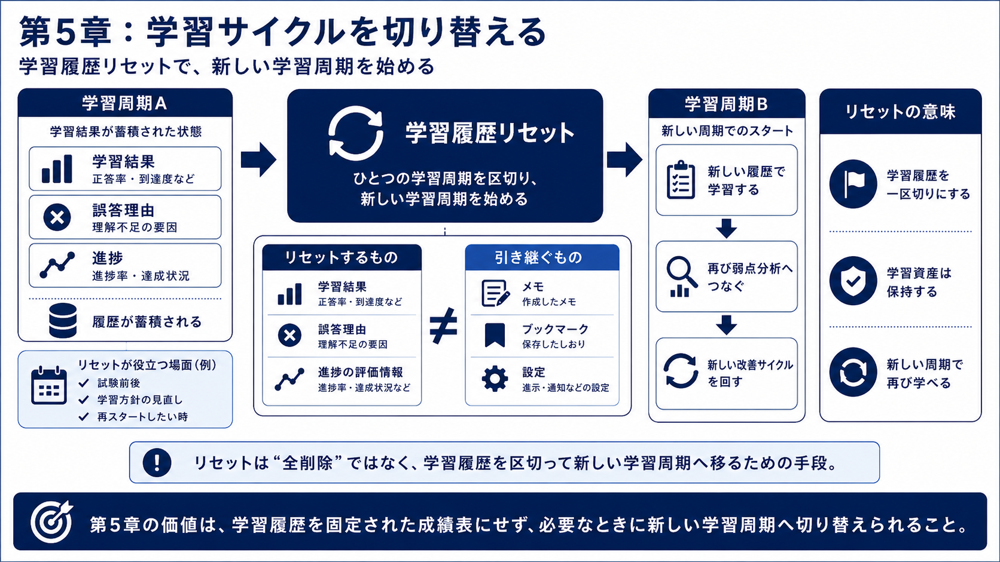
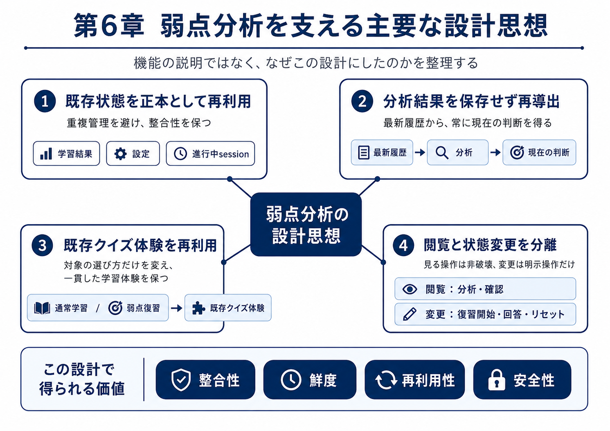
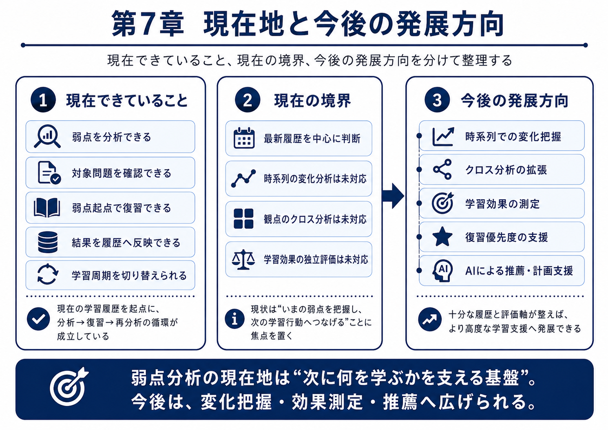
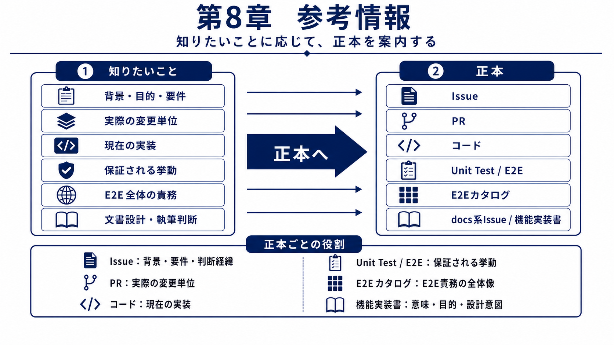

# 弱点分析 機能実装書

## 本文書について

本文書は、DEPクイズアプリにおける弱点分析と、それを学習行動へつなぐ機能群を説明する機能実装書である。学習履歴から弱点を判断し、対象を確認して復習し、結果を再分析へ戻す学習フィードバックループを扱う。

主な読者は、弱点分析や弱点学習機能を改修する前に、機能全体の意図と設計判断を把握したい開発者である。読後には、弱点分析が解決する課題、各機能が循環の中で担う役割、現在実装済みの範囲と将来候補の境界を説明できる。

本文書は全体像と設計意図を示すものであり、詳細な要件、変更差分、実装契約、保証内容は、それぞれIssue、PR、コード、テストなどの正本で確認する。

## 目次

1. 弱点分析の位置付け
2. 弱点分析を起点とする学習フィードバックループ
3. 学習履歴を学習判断へ変える ― 弱点分析の仕組み
4. 分析を学習行動へつなぐ ― 対象問題一覧と弱点起点の復習
5. 学習周期を切り替える ― 学習履歴リセット
6. 弱点分析を支える主要な設計思想
7. 現在地と今後の発展方向
8. 参考情報

## 第1章 弱点分析の位置付け

問題を解いて学習履歴を記録しても、その履歴だけでは次に何を学ぶべきか判断することは難しい。弱点分析は、蓄積された履歴を次の学習判断へ変える**起点**である。

図1が示すように、弱点分析によって、学習履歴から重点的に見直すべきポイントの判断材料が得られる。目的は分析結果を表示することではなく、利用者が**次の学習行動**を選びやすくすることである。

ただし、判断を見るだけでは学習は完結しない。分析から対象確認、復習、履歴反映、再分析までがつながって初めて、履歴の変化を次の行動へ生かせる。第2章では、この学習フィードバックループの全体地図を示す。

## 第2章 弱点分析を起点とする学習フィードバックループ

分析結果を見るだけでは学習は進まない。弱点分析は終点ではなく**起点**である。次の行動を決め、更新された学習履歴を再び判断へ戻す循環を生み出す機能を目指す。

図2の循環では、弱点分析を起点に苦手なポイントを見極めて復習し、その結果を既存の学習履歴へ戻す。これにより、復習の成果を含む最新の履歴から再分析できる。これこそが、**学習フィードバックループによる理想像**である。

一方で、蓄積した履歴は形骸化とも背中合わせにある。学習履歴リセットはこの通常工程ではなく、蓄積した評価履歴を前提とする判断を一区切りにし、新しい**学習周期**へ移るため、必要に応じて分岐できるよう実装している。

以降の章では、循環の各部分を順に説明する。第3章は判断を作り、第4章は判断を行動へつなぎ、第5章は学習周期を切り替える。

## 第3章 学習履歴を学習判断へ変える ― 弱点分析の仕組み

学習履歴だけでは、次に何を見るべきか判断しづらい。理由は、次の行動につながる観点で整理されていないためである。弱点分析では、次の行動を意識した**4つの観点**で学習履歴を整理する。

図3では、学習履歴を4つの観点から整理し、次の学習行動へ活用する考え方を示している。読み手がここで押さえるべきポイントは2点ある。1つ目は、**低い正答率を機械的に同じ弱点として扱わないこと**である。未学習、データ不足、実際に誤答が残る弱点では学習上の意味が異なる。これらを区別できなければ、学習効果を高める復習にはつながらない。

2つ目は、**成長を加味すること**である。弱点分析は固定された成績表ではない。復習や通常学習によって履歴が更新されれば、次に見るべきポイントも変わる。学習を通じて人は成長するため、常に最新の学習履歴から新しい学習判断を導くことが重要である。

ただし、判断材料が得られても、それだけでは復習行動に移れない。次章では、分析結果を具体的な対象確認と復習へつなぐ役割を説明する。

## 第4章 分析を学習行動へつなぐ ― 対象問題一覧と弱点起点の復習

分析結果だけでは、学習行動へ踏み出しきれないケースは多い。利用者の背中を適切に後押しし、行動につなげる工夫が必要である。弱点分析では、**分析結果に応じた問題一覧の抽出**と**重点ポイントの提示**によって、利用者の学習行動をアシストする。

図4では、分析結果から対象問題一覧、弱点起点の復習、進捗反映へ進む流れを示している。この流れで特に押さえるべき点は、対象問題一覧を分析と復習の橋渡しとして置くことである。利用者は、弱点に対応する問題群を確認することで、分析結果を「実際に取り組むべき問題」として見極められる。

弱点起点の復習結果は一時履歴に閉じず、既存の学習履歴へ戻す。これにより、復習後の最新状態をもとに、新たな弱点分析ができる。

一方で、履歴を更新し続けるだけでなく、試験前後や学習方針の変更に合わせて一区切りにしたい場面もある。次章では、新しい学習周期へ移るための学習履歴リセットを説明する。

## 第5章 学習周期を切り替える ― 学習履歴リセット

学習履歴リセットは、すべてを消す操作ではない。これまでの学習履歴を一区切りにし、新しい学習周期を始めるための手段である。

図5では、学習履歴を区切りながら次の周期へ移る考え方を示している。重要なのは、**学習履歴と学習資産を区別すること**である。学習結果や誤答理由のような学習履歴は、現在の状態を判断する材料であり、新しい学習周期へ切り替える際には一区切りにする対象となる。

一方、利用者が育てたメモやブックマーク、設定は**学習資産**である。新しい学習周期でも足場となるため、再利用できるように残す。**学習履歴を区切り、学習資産を残す**という考え方は、弱点分析、復習、リセットを安全に循環させるための設計思想につながる。次章では、その主要な設計思想を整理する。

## 第6章 弱点分析を支える主要な設計思想

弱点分析を学習フィードバックループとして成立させるには、分析・対象確認・復習・学習履歴リセットを、同じ状態管理の考え方でつなぐ必要がある。本章では、その循環を破綻させないための設計思想を整理する。

図6の各思想は、独立したルールではなく、状態重複、分析の陳腐化、体験の分断、意図しない更新を同時に避けるために組み合わされる。これにより、分析結果の整合性と鮮度を保ちながら、既存の学習体験を再利用し、状態変更を利用者の明示的な操作に限定できる。

この設計は、弱点を確認してから復習し、その結果を最新の学習履歴として再分析へ戻す循環の信頼性を支える。第7章では、この思想の上で現在どこまで実現済みかと、まだ現在の機能として扱わない将来候補を分けて説明する。

## 第7章 現在地と今後の発展方向

弱点分析は、最新の学習履歴から現在の弱点を見つけ、対象確認と復習へつなげる段階までを現在実装済みとしている。一方で、今後考えられる拡張を、現在実装済みの機能と同じ確度では扱わない。

図7の将来候補は、保証済み機能や確定ロードマップではない。その中でも、複数の観点を組み合わせて学習状況を捉えるクロス分析、一人ひとりの状況に応じて次の行動を提案するAIリコメンド、施策による変化を確かめる学習効果の測定は、優先度の高い将来構想として位置付ける。実現するには、どの履歴を母数にするか、どの評価指標で効果を測るか、どの判断や推薦を説明可能にするかといった追加設計が必要になる。

したがって、本文書では現在実装済みの機能を、最新の学習履歴にもとづく分析、対象確認、復習、再分析の学習フィードバックループとして位置付ける。将来候補は、その判断材料をさらに活用する方向として扱い、現在の境界と明確に分離する。第8章では、現在地や境界を詳しく確認するための正本を案内する。

## 第8章 参考情報

弱点分析の詳細は、機能実装書へ集約して読むのではなく、知りたい内容に応じて正本を使い分ける必要がある。本章は参考情報を単なるリンク集ではなく、目的に合った確認先を選ぶための文書の出口として位置付ける。

図8は、確認したい内容ごとに参照すべき成果物を整理している。機能実装書は、弱点分析の意味、機能同士の関係、設計思想、現在地を理解するための入口であり、詳細な要件、変更差分、実装契約、テスト保証そのものの正本ではない。

全体像を把握した後は、背景や判断経緯はIssue、変更単位はPR、現行実装の契約はコード、保証される振る舞いはテストを、それぞれの正本として確認する。読者は知りたい内容に対応する正本へ進み、必要な詳細を確認する。
