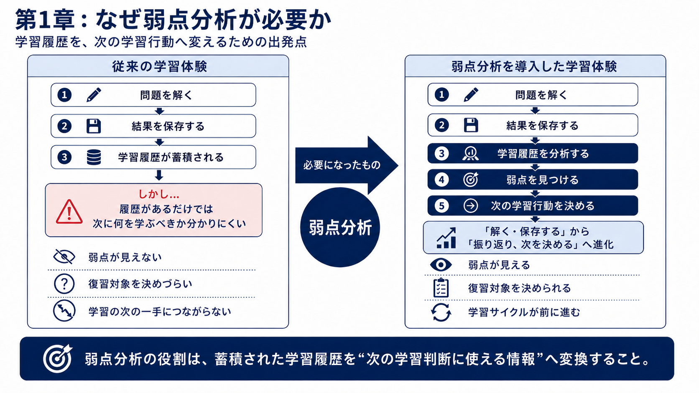
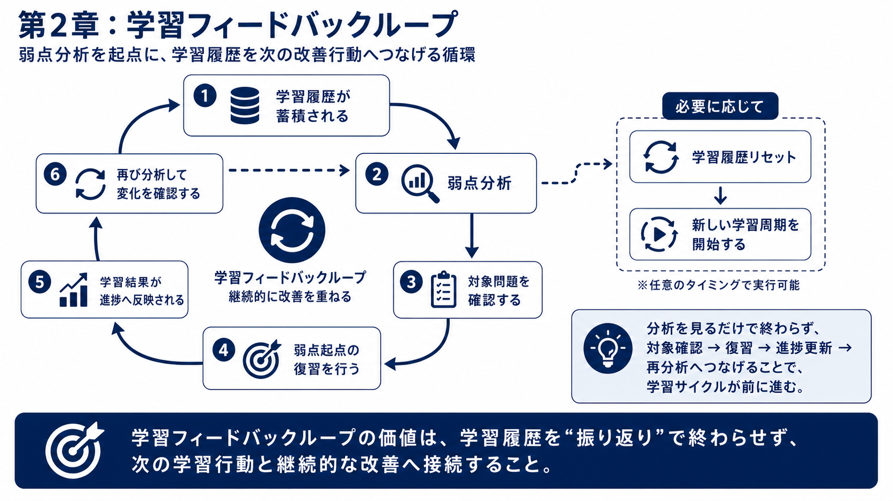
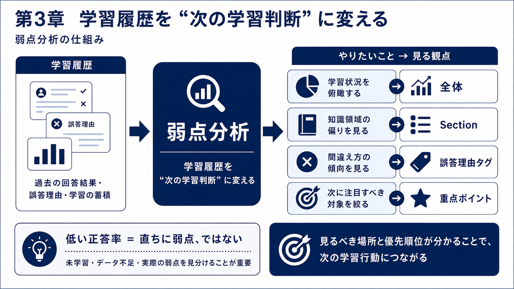
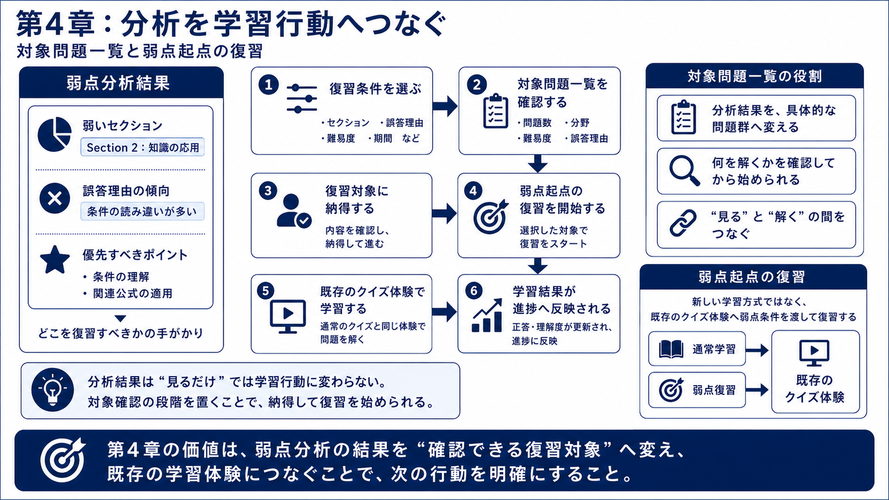
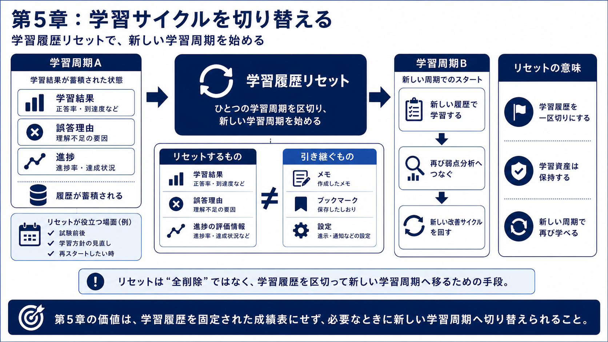
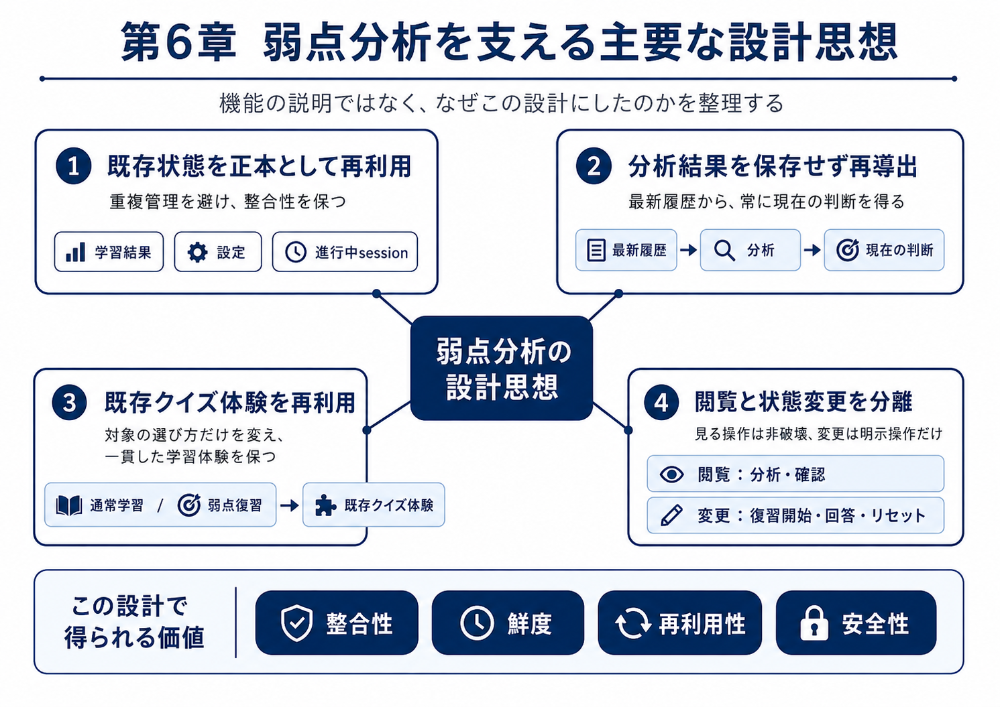
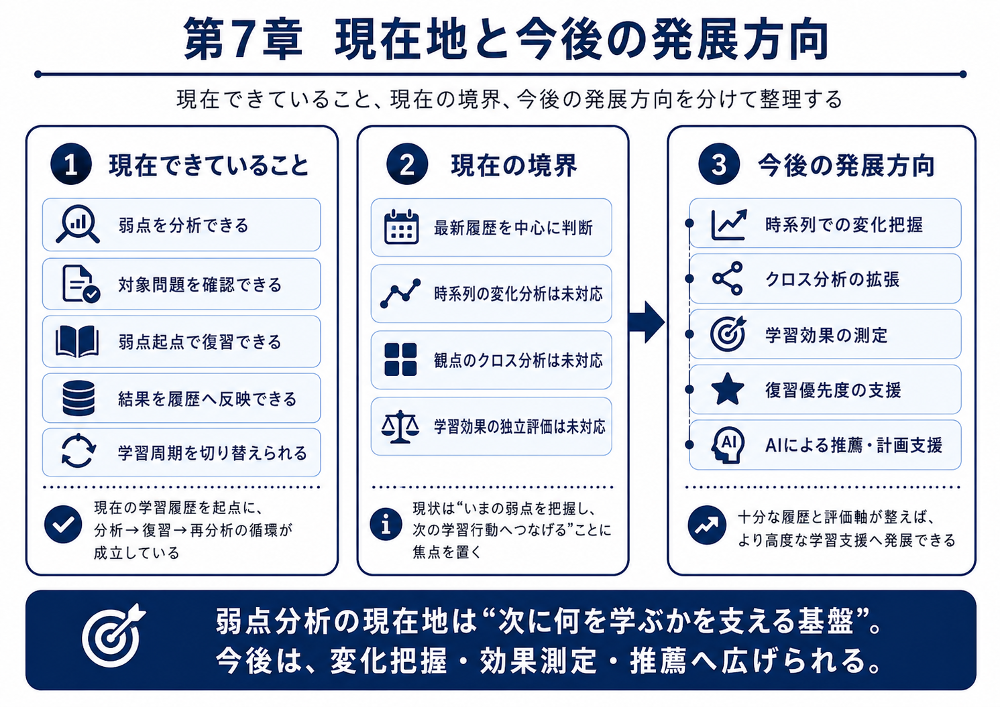
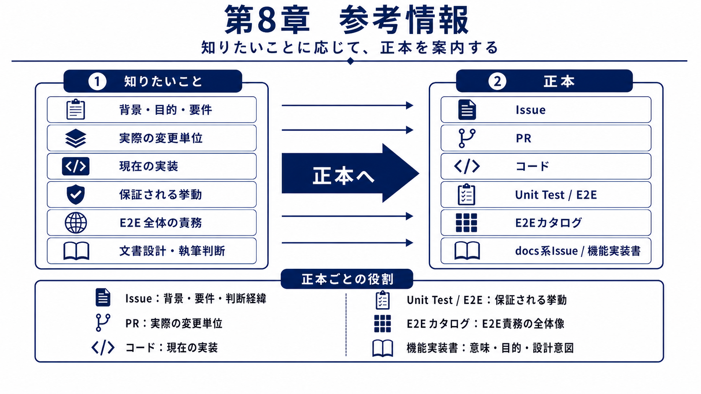

# 弱点分析 機能実装書

## 本文書について

本文書は、DEPクイズアプリにおける弱点分析と、それを学習行動へつなぐ機能群を説明する機能実装書である。学習履歴から弱点を判断し、対象を確認して復習し、結果を再分析へ戻す学習フィードバックループを扱う。

主な読者は、弱点分析や弱点学習機能を改修する前に、機能全体の意図と設計判断を把握したい開発者である。読後には、弱点分析が解決する課題、各機能が循環の中で担う役割、現在実装済みの範囲と将来候補の境界を説明できる。

本文書は全体像と設計意図を示すものであり、詳細な要件、変更差分、実装契約、保証内容は、それぞれIssue、PR、コード、テストなどの正本で確認する。

## 目次

1. 弱点分析の位置付け
2. 弱点分析を起点とする学習フィードバックループ
3. 学習履歴を学習判断へ変える ― 弱点分析の仕組み
4. 分析を学習行動へつなぐ ― 対象問題一覧と弱点起点の復習
5. 学習周期を切り替える ― 学習履歴リセット
6. 弱点分析を支える主要な設計思想
7. 現在地と今後の発展方向
8. 参考情報

## 第1章 弱点分析の位置付け

問題を解いて学習履歴を記録しても、その履歴だけでは次に何を学ぶべきか判断することは難しい。弱点分析は、蓄積された履歴を次の学習判断へ変える**起点**である。

図1が示すように、弱点分析によって、学習履歴から重点的に見直すべきポイントの判断材料が得られる。目的は分析結果を表示することではなく、利用者が**次の学習行動**を選びやすくすることである。

学習履歴は、次のような課題を持つ。

- 正誤の記録や解答日時といった「解いた事実」の集まりであり、そのままでは次にどこを優先して学ぶべきかという観点では整理されていない。
- 正答率が低いという結果だけを見ても、まだ十分に取り組めていないのか、実際に理解が不足しているのかを区別できず、一律に同じ弱点として扱うことはできない。

弱点分析が担うのは、これらの学習履歴を、次に優先して見直すべきポイントの判断材料へと変換することであり、分析結果を示すこと自体を目的にするものではない。

ただし、判断を見るだけでは学習は完結しない。分析から対象確認、復習、履歴反映、再分析までがつながって初めて、履歴の変化を次の行動へ生かせる。第2章では、この学習フィードバックループの全体地図を示す。

**主な参照先**

- 背景・要件：[Issue #197 弱点分析サマリ](https://github.com/yuyuyu0706/quiz-practice/issues/197)
- 現行実装：[`dep-quiz-app/analysis.js`](../../dep-quiz-app/analysis.js)
- 保証される振る舞い：[`scripts/test-dep-weakness-summary.mjs`](../../scripts/test-dep-weakness-summary.mjs)

## 第2章 弱点分析を起点とする学習フィードバックループ

分析結果を見るだけでは学習は進まない。弱点分析は終点ではなく**起点**である。次の行動を決め、更新された学習履歴を再び判断へ戻す循環を生み出す機能を目指す。

図2の循環では、弱点分析を起点に苦手なポイントを見極めて復習し、その結果を既存の学習履歴へ戻す。これにより、復習の成果を含む最新の履歴から再分析できる。これこそが、**学習フィードバックループによる理想像**である。

この循環は、下記の地点でそれぞれ異なる問いを立てることで成り立っている。

- 弱点分析：いま何を優先して見るべきかを判断する。
- 対象確認：分析結果を「実際に取り組む問題」として具体化する。
- 復習：既存のクイズ体験でその対象に取り組む。
- 履歴反映：結果を既存の学習履歴へ書き戻す。

復習結果を専用の履歴に閉じず既存の学習履歴へ戻しているのは、更新後の履歴から弱点分析を再び実行し、次の判断を導けるようにするためである。この往復があることで、判断は一度きりで終わらず、学習が進むたびに更新され続ける。

一方で、蓄積した履歴は形骸化とも背中合わせにある。分析・対象確認・復習・履歴反映は、この循環を回し続けるための通常の学習操作である。これに対し学習履歴リセットは、循環を回す操作の一つではなく、蓄積した評価履歴を前提とする判断を一区切りにして新しい**学習周期**へ切り替えるための、利用者の明示的な操作による分岐である。通常の学習・復習の流れの中で自動的に発生するものではなく、必要に応じて選び取る操作として実装している。

以降の章では、循環の各部分を、対応する完成済み機能と結び付けて詳細化する。

- 第3章：学習履歴から次に見るべきポイントを判断する ― 弱点分析
- 第4章：分析による判断を対象確認と復習という具体的な学習行動へつなぐ ― 対象問題一覧と弱点起点の復習
- 第5章：蓄積した判断を一区切りにし、新しい学習周期へ切り替える ― 学習履歴リセット

**主な参照先**

- 背景・要件：[Issue #253 弱点起点の復習](https://github.com/yuyuyu0706/quiz-practice/issues/253)、[Issue #235 学習履歴リセット・データ管理](https://github.com/yuyuyu0706/quiz-practice/issues/235)
- 現行実装：[`dep-quiz-app/weakness-review-targets.js`](../../dep-quiz-app/weakness-review-targets.js)、[`dep-quiz-app/weakness-review-session.js`](../../dep-quiz-app/weakness-review-session.js)、[`dep-quiz-app/learning-history-reset.js`](../../dep-quiz-app/learning-history-reset.js)
- 利用者導線と横断保証：[`tests/e2e/dep-weakness-review-d3-integration.spec.ts`](../../tests/e2e/dep-weakness-review-d3-integration.spec.ts)

## 第3章 学習履歴を学習判断へ変える ― 弱点分析の仕組み

学習履歴だけでは、次に何を見るべきか判断しづらい。理由は、次の行動につながる観点で整理されていないためである。弱点分析では、次の行動を意識した**4つの観点**で学習履歴を整理する。

図3では、学習履歴を4つの観点から整理し、次の学習行動へ活用する考え方を示している。各観点は異なる学習上の問いに答える。

- **全体**：いまの学習状況を全体としてどう捉えるか。全問題を横断して正答率・誤答数・到達状況を集約し、学習の全体像を把握する起点となる。
- **Section（章・分野）別**：どの章や分野に課題が集中しているか。セクションごとの誤答数や正答率を比較することで、優先して見直すべき範囲を絞り込める。
- **誤答理由タグ**：どういった理由で誤答が生じているか。誤答の原因を横断して集計し、弱点のパターンを把握する。
- **重点ポイント**：いま最初に取り組むべき対象はどこか。Sectionと誤答理由タグをそれぞれ優先順位付けし、次の行動の手がかりとして具体的な1件を示す。

### 分析の前提となる回答状況の評価

読み手がここで押さえるべきポイントは2点ある。1つ目は、**低い正答率を機械的に同じ弱点として扱わないこと**である。未学習、データ不足、実際に誤答が残る弱点では学習上の意味が異なる。これらを区別できなければ、学習効果を高める復習にはつながらない。

弱点分析では、Sectionごとに「まだ取り組んでいないのか」「取り組み始めたが傾向を判断できる回数に達していないのか」「傾向を示せる状態にあるか」という回答状況を評価する。回答数がゼロの場合は弱点の判断を行わず、一定数の回答が蓄積されて初めて傾向を分析する。これにより、未学習の状態を誤って「全問正解の得意分野」や「弱点」として扱うことを避けられる。

また、正答率を算出するには、解答回数・正答数・誤答数の記録が整合していることが前提となる。記録が整合しない場合や、まだ一度も回答していない場合は正答率を算出せず、「正答率0%の弱点」として扱わない。正答率が意味を持つのは、十分な回答記録が整合した状態にある場合だけである。

### 最新の学習履歴から都度導出する

2つ目は、**成長を加味すること**である。弱点分析は固定された成績表ではない。復習や通常学習によって履歴が更新されれば、次に見るべきポイントも変わる。学習を通じて人は成長するため、常に最新の学習履歴から新しい学習判断を導くことが重要である。

弱点分析は、実行のたびに最新の学習履歴を入力として受け取り、その場で結果を導出する。分析結果を保存しておき、次回はそれを参照する設計ではない。これは第2章で示した学習フィードバックループの実現形であり、復習後の最新履歴から新しい学習判断を得るという循環を支えている。

### UIは分析結果の表示変換に専念する

弱点分析の集計・優先度判定は、分析ロジックとして一か所に集約されている。画面表示を担うUIは、その出力を受け取って読みやすい形に変換する役割に限定しており、独自に集計を再計算したり優先度を再判定したりしない。

このように責務を分離することで、分析ロジックを変更したときに画面側へ影響が漏れにくくなり、また画面を変更しても分析の正確性が損なわれない。保証されている分析の振る舞いは分析ロジック側のテストで確認でき、UI固有の振る舞いはUIのテストで確認できる。

ただし、判断材料が得られても、それだけでは復習行動に移れない。次章では、分析結果を具体的な対象確認と復習へつなぐ役割を説明する。

**主な参照先**

- 背景・要件：[Issue #197 弱点分析サマリ](https://github.com/yuyuyu0706/quiz-practice/issues/197)
- 現行実装：[`dep-quiz-app/analysis.js`](../../dep-quiz-app/analysis.js)
- 保証される振る舞い：[`scripts/test-dep-weakness-summary.mjs`](../../scripts/test-dep-weakness-summary.mjs)
- 利用者導線：[`tests/e2e/dep-weakness-summary.spec.ts`](../../tests/e2e/dep-weakness-summary.spec.ts)

## 第4章 分析を学習行動へつなぐ ― 対象問題一覧と弱点起点の復習

分析結果だけでは、学習行動へ踏み出しきれないケースは多い。利用者の背中を適切に後押しして、次の行動に繋ぐ工夫が必要である。弱点分析では、**分析結果に応じた問題一覧の抽出**と**重点ポイントの提示**によって、利用者の学習行動をアシストする。

図4では、分析結果から対象問題一覧、弱点起点の復習、進捗反映へ進む流れを示している。この流れで特に押さえるべき点は、対象問題一覧を分析と復習の橋渡しとして置くことである。利用者は、弱点に対応する問題群を確認することで、分析結果を「実際に取り組むべき問題」として見極められる。

### 弱点問題の抽出条件と分析観点の紐付け

弱点となる問題の抽出条件は2種類ある。**Section別**（ある章・分野に属する全問題を対象にする）と**誤答理由タグ別**（特定の誤答理由タグが付いた全問題を対象にする）である。

第3章で整理した4つの分析観点のうち、Section別と誤答理由タグの2つが、直接行動につながる抽出条件として機能する。全体の観点は学習状況を俯瞰するための出発点となり、重点ポイントの観点は次の行動の手がかりを1件示す。これらは「どこに課題があるか」を把握するための情報として働き、抽出条件に直接対応するのはSection別と誤答理由タグである。利用者は分析画面で「どのSectionを復習するか」「どの誤答理由に絞るか」を選ぶことで、取り組むべき弱点問題一覧に絞り込める。

### 弱点問題一覧に付く状態

弱点問題一覧では、各問題に現在の学習状態が付く。状態は4種類あり、それぞれ学習上の意味が異なる。

- **誤答が残っている**：最近の解答で誤答が記録されており、見直しを要する状態。
- **正答を記録している**：誤答は残っていないが、解答記録があり正答で終えている状態。
- **解答はあるが正誤が確定していない**：解いた記録はあるが、現時点では正答も誤答も記録されていない状態。
- **まだ一度も解いていない**：解答記録がなく、初めて見ることになる問題。

利用者はこの状態を見て、「誤答が残っている問題から始める」「まだ取り組んでいない問題を先にやる」といった学習判断ができる。弱点確認の段階で一覧全体の状況を把握してから復習に入れることが、弱点問題一覧を橋渡しする理由の一つである。

### 弱点が0件の場合

選んだ条件に該当する問題が存在しない場合、対象問題一覧は「対象なし」状態として扱われ、復習セッションは開始しない。このため、中身が空のセッションが誤って開始される状況が生じない。利用者に対しては、弱点問題が見つからなかったことが画面上で示される。

### 抽出条件はセッション開始後も引き継ぐ

弱点復習セッションを開始すると、分析で選んだ抽出条件（Section別か誤答理由タグ別か、その具体的な値とラベル）がセッション状態として引き継がれる。クイズを解いている最中も「なぜこの問題群に取り組んでいるか」という文脈が保持されるため、復習の意図が途中で失われない。

### 復習結果を学習履歴へ書き戻す理由

弱点起点の復習結果は専用の履歴に閉じず、既存の学習履歴へ書き戻す。セッション開始時点では学習履歴は変わらず、セッションが完了したときに初めて反映される。

この設計は、第2章で示した学習フィードバックループを閉じるためのものである。復習後の最新履歴から再分析を実行することで、「復習を経て弱点が解消されたか」「新たに取り組むべき箇所はどこか」を改めて把握できる。復習の結果が分離された場所に留まってしまうと、弱点分析が常に同じ履歴を参照することになり、復習の成果が次の判断へ反映されない。

一方で、履歴を更新し続けるだけでなく、試験前後や学習方針の変更に合わせて一区切りにしたい場面もある。次章では、新しい学習周期へ移るための学習履歴リセットを説明する。

**主な参照先**

- 背景・要件：[Issue #253 弱点起点の復習](https://github.com/yuyuyu0706/quiz-practice/issues/253)
- 現行実装：[`dep-quiz-app/weakness-review-targets.js`](../../dep-quiz-app/weakness-review-targets.js)、[`dep-quiz-app/weakness-review-session.js`](../../dep-quiz-app/weakness-review-session.js)
- 利用者導線と横断保証：[`tests/e2e/dep-weakness-review-d3-integration.spec.ts`](../../tests/e2e/dep-weakness-review-d3-integration.spec.ts)

## 第5章 学習周期を切り替える ― 学習履歴リセット

学習履歴リセットは、すべてを消す操作ではない。これまでの学習履歴を一区切りにし、新しい学習周期を始めるための手段である。

図5では、学習履歴を区切りながら次の周期へ移る考え方を示している。本章では、設計の意図と責務境界を6つの問いに沿って説明する。

### なぜ分析結果ではなく学習履歴をリセットするのか

第3章で示したとおり、弱点分析は学習履歴を毎回参照して分析結果を導き出す。分析結果を直接クリアしても、元となる学習履歴が残れば、次の分析でも同じ判断に至り、成長体験に繋がらない。成長体験に繋げるためには、新しい学習周期が必要である。これを実現するために、あえて学習履歴をリセットして、判断の源泉を区切るアクションが重要だ。

### 再利用性の観点で「学習履歴」と「学習資産」を区別する

重要なのは、**学習履歴と学習資産を区別すること**である。正誤回数・誤答理由・最終回答日時のような「現在の判断材料」はリセット対象となる。これらは現在の学習周期における評価結果であり、新しい周期を始める際には一区切りにする。

一方、利用者が育てたメモ・ブックマーク・設定は、**再利用性が高い学習資産である**。新しい学習周期でも足場となるため、再利用できるように残す。リセット後にメモもブックマークも持たないエントリは保存先から削除され、保持の意味がある記録だけが残る。

### 「中断セッション」もリセット対象

リセット計画を生成する際に、進行中の中断セッションが存在するかどうかも確認する。中断セッションが残ると、リセット後も途中から再開できる状態になる。しかし、この状態は新しい学習周期の起点とは呼べない。そのため中断セッションもリセット計画の対象に含め、リセットを確定するタイミングで同時に削除する。リセット後は再開ボタンは表示させず、新しい学習周期の起点として始められる。

### リセット実行には2段階確認を必要とする

リセットは取り消せない操作である。そのためリセット実行前に確認を促す「2段階確認」を設計している。計画生成の段階では、リセット対象の問題数・保持されるメモ件数・ブックマーク件数・中断セッションの有無を含む影響範囲を算出するが、この時点では保存先への変更は一切行わない。利用者が影響範囲を確認したうえで明示的に確定した場合にのみ、実際のリセット処理を実行する。キャンセルやダイアログを閉じた場合、リセットしないことを保証する。

### 保存失敗時は中途半端な状態を残してはいけない

リセットの保存処理が途中で失敗した場合、一部だけリセットされた中途半端な状態は残さない。復元に成功した場合はダイアログが開いたまま再試行できる状態を維持し、保存先に変更は生じさせない。復元にも失敗した場合は再試行の操作をブロックし、再読み込みで状態を確認するよう案内する。どちらの場合も、利用者が意図しない途中状態で学習を続けることを防ぐ。

### リセット後に分析が未学習状態へ戻り、学習資産を使い続けられるか

リセット後に弱点分析を実行すると、誤答数はゼロ・正答率は未算出の状態から再出発する。復習用の弱点問題が存在しない状態となり、学習履歴が白紙の新しい周期の起点として機能する。一方、保持したブックマークを使った復習やメモを持つ問題の復習は引き続き機能し、利用者が育てた学習資産を新しい周期でも活用できる。

### 主要参照先

第5章の設計の詳細と保証は、以下の正本で確認できる。

- Issue #235（学習履歴リセット・データ管理）：リセット機能の要件と設計判断の背景
- `dep-quiz-app/learning-history-reset.js`（`buildLearningHistoryResetPlan()`）：計画生成ロジックと保存境界の実装
- `tests/e2e/dep-learning-history-reset-management.spec.ts`：二段階確認・キャンセル・失敗ハンドリング・リセット後の各復習導線の保証

次章では、弱点分析、復習、リセットを安全に循環させるための主要な設計思想を整理する。

## 第6章 弱点分析を支える主要な設計思想

弱点分析を学習フィードバックループとして成立させるには、分析・対象確認・復習・学習履歴リセットを、同じ状態管理の考え方でつなぐ必要がある。本章では、その循環を破綻させないための4つの設計思想を整理する。

### 思想1：既存状態を正本として再利用する

**何を防ぐか：** 分析・対象確認・復習・リセットが、それぞれ独立した状態コピーを持つことによる整合性の破綻を防ぐ。

各機能が同じ `depQuizProgress` をそのまま受け取ることで、どのタイミングで分析しても・対象確認しても・リセットしても、常に同一の学習履歴を参照する。`buildWeaknessAnalysis(questions, progress)`、`buildWeaknessReviewTargetPlan({ questions, progress, condition })`、`buildLearningHistoryResetPlan(progress)` のいずれも、外部から渡された `progress` を入力として受け取るだけであり、内部で状態のコピーを保持しない。これにより、複数の機能が互いに異なる「自前の状態コピー」を持って乖離するという状況が生じない。

### 思想2：分析結果を保存せず、最新履歴から再導出する

**何を防ぐか：** 保存した分析結果が学習の進行によって陳腐化し、実際の状態と乖離することを防ぐ。

`buildWeaknessAnalysis()` は storage への書き込みを一切行わない pure function である。分析結果はその場で導出され、保存も蓄積もしない。復習が完了して `depQuizProgress` が更新されると、次回の分析実行時には最新の `depQuizProgress` から自動的に再計算される。これにより、「保存時点の分析」が現在の学習状態と乖離するという問題が起きない。

### 思想3：専用クイズエンジンを作らず、既存クイズ体験を再利用する

**何を防ぐか：** 弱点復習専用の並行実装による保守負担と、通常学習と弱点復習の体験の分断を防ぐ。

`createWeaknessReviewSession()` は内部で `createSession(order, WEAKNESS_REVIEW_MODE, settingsSnapshot)` を呼び出す。変わるのは問題の選び方（`order`：弱点問題のIDリスト）と `settingsSnapshot.condition`（弱点抽出条件の引き継ぎ）のみであり、クイズ進行・回答受付・履歴書き戻しの仕組みは既存の `quiz-session.js` をそのまま使う。弱点復習のためだけにクイズエンジンを別途実装しないため、クイズ体験の一貫性が保たれ、保守負担が生じない。

### 思想4：閲覧と状態変更を分離する

**何を防ぐか：** 対象一覧の閲覧・条件変更・分析の閲覧が、意図せず storage を書き換えることを防ぐ。

`buildWeaknessAnalysis()`、`buildWeaknessReviewTargetPlan()`、`buildLearningHistoryResetPlan()` はすべて read-only であり、呼び出しただけでは storage への変更が生じない。状態変更は「復習セッション開始」「回答送信」「リセット実行（`commitLearningHistoryReset()`）」という利用者の明示的な操作のみで行われる。これにより、分析・確認といった閲覧操作が意図せず学習履歴を書き換えるリスクがない。

### 4思想の組み合わせ効果

各思想は独立したルールではなく、組み合わせることで循環の信頼性が高まる。

- **思想1 × 思想2**：単一正本（`depQuizProgress`）があるため、「最新履歴からの再導出」が常に正確に動く。別々のコピーが存在しないので、再導出結果がどの機能から見ても一致する。
- **思想2 → 思想1**：分析結果を保存しないため、復習後の再分析では思想1の最新状態が自動的に反映される。保存された古い分析結果が残ることはない。
- **思想3 × 思想4**：既存クイズ体験を再利用することで、クイズエンジンレベルでも閲覧と変更の分離が維持される。弱点復習専用のエンジンを作ると、その独自エンジンで思想4を別途実装する必要が生じる。
- **思想4 → 思想1**：閲覧操作が状態を変えないため、思想1の単一正本が汚染されない。誰かが分析・確認を実行しても、学習履歴は変わらない。

**主な参照先**

- 現行実装：[`dep-quiz-app/analysis.js`](../../dep-quiz-app/analysis.js)（`buildWeaknessAnalysis()`）
- 現行実装：[`dep-quiz-app/weakness-review-targets.js`](../../dep-quiz-app/weakness-review-targets.js)（`buildWeaknessReviewTargetPlan()`）
- 現行実装：[`dep-quiz-app/weakness-review-session.js`](../../dep-quiz-app/weakness-review-session.js)（`createWeaknessReviewSession()`）
- 現行実装：[`dep-quiz-app/learning-history-reset.js`](../../dep-quiz-app/learning-history-reset.js)（`buildLearningHistoryResetPlan()`）
- 横断E2E：[`tests/e2e/dep-weakness-review-d3-integration.spec.ts`](../../tests/e2e/dep-weakness-review-d3-integration.spec.ts)

## 第7章 現在地と今後の発展方向

弱点分析は、最新の学習履歴から現在の弱点を見つけ、対象確認と復習へつなげる段階までを現在実装済みとしている。一方で、今後考えられる拡張を、現在実装済みの機能と同じ確度では扱わない。

### 現在保証されていること（E2Eで確認済み）

以下は現在実装済みであり、E2Eテストによって振る舞いが保証されている。

- 弱点分析（全体・Section別・誤答理由タグ・重点ポイント）の都度導出
- 分析結果から対象問題一覧の確認（`buildWeaknessReviewTargetPlan()`）
- 弱点起点の復習セッション（`createWeaknessReviewSession()`）
- 復習完了後の `depQuizProgress` への書き戻し → 再分析で最新状態が反映される（D3横断ループ保証）
- 学習履歴リセット（計画確認 → 実行）とリセット後に弱点分析が未学習状態から再出発する回帰

### 意図した現在の制約

以下は機能の欠如ではなく、現在の設計として意図した制約である。

- 分析結果は storage に保存されない（常に再計算 — `buildWeaknessAnalysis()` は pure function）
- 対象抽出条件は `section` または `wrongReasonTag` の1種類のみ（`condition.type` が二択）
- 弱点復習セッション中の対象問題の追加・変更は不可
- 学習履歴リセットは利用者の明示的操作のみ（循環中に自動実行されない）
- 正答率は `correctCount + wrongCount ≠ totalAttemptCount` の場合に算出しない（`accuracyRateStatus: 'inconsistent-counts'`）

### 未実装領域

以下は現時点では実装していない領域である。

- 複数条件の組み合わせ（section AND wrongReasonTag）
- 分析結果の時系列記録・推移比較
- 復習途中での対象問題の動的な追加・除外

### 将来候補（保証済み機能でも確定ロードマップでもない）

以下は今後の発展方向として考えられるものの、保証済み機能でも確定ロードマップでもなく、それぞれ追加設計が必要となる。

- **時系列分析**：いつの学習履歴を母数にするか、どの時点の状態を比較するかの設計が必要
- **クロス分析**（Section × 誤答理由タグ）：対象抽出条件の型拡張と分析軸の追加設計が必要
- **学習効果測定**（復習前後の比較）：どの評価指標で測るか、比較ベースラインの定義が必要
- **AIリコメンド**：どの判断・推薦を説明可能にするかの設計が必要

**主な参照先**

- 横断E2E：[`tests/e2e/dep-weakness-review-d3-integration.spec.ts`](../../tests/e2e/dep-weakness-review-d3-integration.spec.ts)
- リセット管理E2E：[`tests/e2e/dep-learning-history-reset-management.spec.ts`](../../tests/e2e/dep-learning-history-reset-management.spec.ts)
- 現行実装：[`dep-quiz-app/analysis.js`](../../dep-quiz-app/analysis.js)、[`dep-quiz-app/weakness-review-targets.js`](../../dep-quiz-app/weakness-review-targets.js)、[`dep-quiz-app/weakness-review-session.js`](../../dep-quiz-app/weakness-review-session.js)、[`dep-quiz-app/learning-history-reset.js`](../../dep-quiz-app/learning-history-reset.js)

## 第8章 参考情報

弱点分析の詳細は、機能実装書へ集約して読むのではなく、知りたい内容に応じて正本を使い分ける必要がある。本章は参考情報を単なるリンク集ではなく、目的に合った確認先を選ぶための文書の出口として位置付ける。

図8は、確認したい内容ごとに参照すべき成果物を整理している。機能実装書は、弱点分析の意味、機能同士の関係、設計思想、現在地を理解するための入口であり、詳細な要件、変更差分、実装契約、テスト保証そのものの正本ではない。

全体像を把握した後は、背景や判断経緯はIssue、変更単位はPR、現行実装の契約はコード、保証される振る舞いはテストを、それぞれの正本として確認する。読者は知りたい内容に対応する正本へ進み、必要な詳細を確認する。
